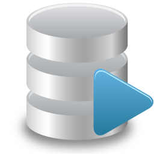

<p align="center"></p>

:information_source: &nbsp;Este repositório contém perguntas e exercícios sobre vários tópicos técnicos, às vezes relacionados a DevOps e SRE

:bar_chart: &nbsp;Existem atualmente 2610 exercícios e perguntas.

:warning: &nbsp;Você pode usá-los para se preparar para uma entrevista, mas a maioria das perguntas e exercícios não representam uma entrevista real. Por favor, leia a [ página de perguntas frequentes](faq.md) para mais detalhes.

:stop_sign: &nbsp;Se você estiver interessado em seguir a carreira de engenheiro de DevOps, aprender alguns dos conceitos mencionados aqui seria útil, mas você deve saber que não se trata de aprender todos os tópicos e tecnologias mencionados neste repositório.

:pencil: &nbsp;Você pode adicionar mais exercícios enviando solicitações de pull :) Leia sobre as diretrizes de contribuição [aqui](CONTRIBUTING.md)

****

<!-- ALL-TOPICS-LIST:START -->
<!-- prettier-ignore-start -->
<!-- markdownlint-disable -->
<center>
<table>
  <tr>
    <td align="center"><a href="topics/devops/README.md"><br /><b>DevOps</b></a></td>
    <td align="center"><a href="topics/cicd/README.md"><br /><b>CI/CD</b></a></td>
    <td align="center"><a href="topics/git/README.md"><br /><b>Git</b></a></td>
    <td align="center"><a href="topics/ansible/README.md"><br /><b>Ansible</b></a></td>
    <td align="center"><a href="#network"><br /><b>Network</b></a></td>
   

  </tr>
  <tr>
    <td align="center"><a href="topics/software_development/README.md"><br /><b>Software Development</b></a></td>
    <td align="center"><a href="https://github.com/bregman-arie/python-exercises"><br /><b>Python</b></a></td>
    <td align="center"><a href="https://github.com/bregman-arie/go-exercises"><br /><b>Go</b></a></td>
    <td align="center"><a href="topics/shell/README.md"><br /><b>Shell Scripting</b></a></td>
    <td align="center"><a href="topics/kubernetes/README.md"><br /><b>Kubernetes</b></a></td>
 
  </tr>
  <tr>
    <td align="center"><a href="topics/cloud/README.md"><br /><b>Cloud</b></a></td>
    <td align="center"><a href="topics/aws/README.md"><br /><b>AWS</b></a></td>
    <td align="center"><a href="topics/azure/README.md"><br /><b>Azure</b></a></td>
    <td align="center"><a href="topics/gcp/README.md"><br /><b>Google Cloud Platform</b></a></td>
    <td align="center"><a href="#openstack"><br /><b>OpenStack</b></a></td>
  </tr>
  <tr>
    <td align="center"><a href="#operating-system"><br /><b>Operating System</b></a></td>
    <td align="center"><a href="#monitoring"><br /><b>Monitoring</b></a></td>
    <td align="center"><a href="#elastic"><br /><b>Elastic</b></a></td>
    <td align="center"><a href="#virtualization"><br /><b>Virtualization</b></a></td>
    <td align="center"><a href="topics/dns/README.md"><br /><b>DNS</b></a></td>
  </tr>
  <tr>
    <td align="center"><a href="#testing"><br /><b>Testing</b></a></td>
    <td align="center"><a href="#databases"><br /><b>Databases</b></a></td>
    <td align="center"><a href="#regex"><br /><b>Regex</b></a></td>
    <td align="center"><a href="#system-design"><br /><b>System Design</b></a></td>
    <td align="center"><a href="#hardware"><br /><b>Hardware</b></a></td>
  </tr>
  <tr>
    <td align="center"><a href="#certificates"><br /><b>Certificates</b></a></td>
    <td align="center"><a href="topics/containers/README.md"><br /><b>Containers</b></a></td>
    <td align="center"><a href="#sql"><br /><b>SQL</b></a></td>
    <td align="center"><a href="topics/openshift/README.md"><br /><b>OpenShift</b></a></td>
    <td align="center"><a href="#storage"><br /><b>Storage</b></a></td>
  </tr>
  <tr>
      <td align="center"><a href="topics/terraform/README.md"><br /><b>Terraform</b></a></td>
      <td align="center"><a href="#mongo"><br /><b>Mongo</b></a></td>
      <td align="center"><a href="#puppet"><br /><b>Puppet</b></a></td>
      <td align="center"><a href="#distributed"><br /><b>Distributed</b></a></td>
      <td align="center"><a href="#questions-you-ask"><br /><b>Questions you can ask</b></a></td>
  </tr>
  <tr>
      <td align="center"><a href="topics/circleci/README.md"><br /><b>Circle CI</b></a></td>
      <td align="center"><a href="topics/argo/README.md"><br /><b>Argo</b></a></td>
      <td align="center"><a href="topics/kafka/README.md"><br /><b>Kafka</b></a></td>
      <td align="center"><a href="topics/datadog/README.md"><br /><b></b></a></td>
      <td align="center"><a href="topics/perl/README.md"><br /><b>Perl</b></a></td>
  </tr>
   <tr>
    <td align="center"><a href="topics/linux/README.md"><br /><b>Linux</b></a></td>
    <td align="center"><a href="#prometheus"><br /><b>Prometheus</b></a></td>
    <td align="center"><a href="#big-data"><br /><b>Big Data</b></a></td>
    <td align="center"><a href="topics/soft_skills/README.md"><br /><b>Soft Skills</b></a></td>
    <td align="center"><a href="topics/security/README.md"><br /><b>Security</b></a></td>
   </tr>
   <tr>
    <td align="center"><a href="topics/chaos_engineering/README.md"><br /><b>Chaos Engineering</b></a></td>
    <td align="center"><a href="#Misc"><br /><b>Misc</b></a></td>
   </tr>
   
</table>
</center>
<!-- markdownlint-enable -->
<!-- prettier-ignore-end -->
<!-- ALL-TOPICS-LIST:END -->

## REDES

<details>
<summary>In Em geral, o que você precisa para se comunicar?</summary><br><b>

  - A common language (for the two ends to understand)
  - A way to address who do you want to communicate with
  - A Connection (so the content of the communication can reach the recipients)

</b></details>

<details>
<summary>Oque é  TCP/IP?</summary><br><b>

Um conjunto de protocolos que definem como dois ou mais dispositivos podem se comunicar entre si.

Para saber mais sobre TCP/IP, leia [Aqui](http://www.penguintutor.com/linux/basic-network-reference)

</b></details>

<details>
<summary>Oque é Ethernet?</summary><br><b>

Ethernet simplesmente se refere ao tipo mais comum de rede local (LAN) usado hoje. Uma LAN – em contraste com uma WAN (Wide Area Network), que abrange uma área geográfica maior – é uma rede conectada de computadores em uma área pequena, como seu escritório, campus universitário ou até mesmo em casa.

</b></details>

<details>
<summary>O que é um endereço MAC? Para que isso é usado?</summary><br><b>

Um endereço MAC é um número ou código de identificação exclusivo usado para identificar dispositivos individuais na rede.

Os pacotes enviados na ethernet sempre vêm de um endereço MAC e são enviados para um endereço MAC. Se um adaptador de rede estiver recebendo um pacote, ele está comparando o endereço MAC de destino do pacote com o próprio endereço MAC do adaptador.

</b></details>

<details>
<summary>Quando este endereço MAC é usado?: ff:ff:ff:ff:ff:ff</summary><br><b>

Quando um dispositivo envia um pacote para o endereço MAC de broadcast (FF:FF:FF:FF:FF:FF​), ele é entregue a todas as estações da rede local. Os broadcasts Ethernet são usados ​​para resolver endereços IP para endereços MAC (por ARP) na camada de enlace de dados.
</b></details>

<details>
<summary>O que é um endereço IP?</summary><br><b>

Um endereço de Protocolo de Internet (endereço IP) é um rótulo numérico atribuído a cada dispositivo conectado a uma rede de computadores que usa o Protocolo de Internet para comunicação. Um endereço de IP tem duas funções principais: identificação de interface de rede ou host e endereçamento de local.
</b></details>

<details>
<summary>Explique a máscara de sub-rede e dê um exemplo</summary><br><b>

Uma máscara de sub-rede é um número de 32 bits que mascara um endereço IP e divide o endereço IP em endereço de rede e endereço de host. A máscara de sub-rede é feita definindo os bits de rede para todos os "1"s e configurando os bits do host para todos os "0"s. Dentro de uma determinada rede, do total de endereços de host utilizáveis, dois são sempre reservados para fins específicos e não podem ser alocados a nenhum host. Estes são o primeiro endereço, que é reservado como um endereço de rede (também conhecido como ID de rede) e o último endereço usado para transmissão de rede.

[Example](https://github.com/philemonnwanne/o0o0o/tree/main/exes/exe-09)

</b></details>

<details>
<summary>O que é um endereço IP privado? Em quais cenários/projetos de sistema, deve-se usá-lo?</summary><br><b>
ndereços IP privados são atribuídos aos hosts na mesma rede para comunicação entre si. Como o nome "privado" sugere, os dispositivos com os endereços IP privados atribuídos não podem ser alcançados pelos dispositivos de nenhuma rede externa. Por exemplo, se eu estiver morando em um albergue e quiser que meus companheiros de albergue entrem no servidor de jogo que eu hospedei, pedirei que eles entrem através do endereço IP privado do meu servidor, já que a rede é local para o albergue.
</b></details>

<details>
<summary>O que é um endereço IP público? Em quais cenários/projetos de sistema, deve-se usá-lo?</summary><br><b>
Um endereço IP público é o endereço IP voltado para o público. No caso de você estar hospedando um servidor de jogo no qual deseja que seus amigos participem, você fornecerá a seus amigos seu endereço IP público para permitir que seus computadores identifiquem e localizem sua rede e servidor para que a conexão ocorra. Uma vez que você não precisaria usar um endereço IP público é no caso de estar jogando com amigos que estavam conectados à mesma rede que você, nesse caso, você usaria um endereço IP privado. Para que alguém possa se conectar ao seu servidor que está localizado internamente, você terá que configurar um encaminhamento de porta para informar ao seu roteador para permitir o tráfego do domínio público em sua rede e vice-versa.
</b></details>

<details>
<summary>Explique o modelo OSI. Que camadas existem? Pelo que cada camada é responsável?</summary><br><b>

- Aplicação: usuário final (HTTP está aqui)
- Apresentação: estabelece o contexto entre as entidades da camada de aplicação (A criptografia está aqui)
- Sessão: estabelece, gerencia e encerra as conexões
- Transporte: transfere sequências de dados de comprimento variável de uma origem para um host de destino (TCP e UDP estão aqui)
- Rede: transfere datagramas de uma rede para outra (IP é aqui)
- Link de dados: fornece um link entre dois nós conectados diretamente (o MAC está aqui)
- Físico: a especificação elétrica e física da conexão de dados (os bits estão aqui)

Você pode ler mais sobre o modelo OSI em [penguintutor.com](http://www.penguintutor.com/linux/basic-network-reference)
</b></details>

<details>
<summary>Para cada um dos seguintes determina a qual camada OSI ele pertence:

* Correção de erros
* Roteamento de pacotes
* Cabos e sinais elétricos
* Endereço MAC
* endereço de IP
* Encerrar conexões
* aperto de mão de 3 vias
	
</b></details>

<details>
<summary>Quais esquemas de entrega você conhece?</summary><br><b>

Unitcast: comunicação um para um onde há um remetente e um destinatário.

Broadcast: Enviando uma mensagem para todos na rede. O endereço ff:ff:ff:ff:ff:ff é usado para transmissão. Dois protocolos comuns que usam broadcast são ARP e DHCP.

Multicast: Enviando uma mensagem para um grupo de assinantes. Pode ser um-para-muitos ou muitos-para-muitos.

Multicast: Sending a message to a group of subscribers. It can be one-to-many or many-to-many.
</b></details>

<details>
<summary>O que é CSMA/CD? É usado em redes ethernet modernas?</summary><br><b>
CSMA/CD significa Carrier Sense Multiple Access / Collision Detection. Seu foco principal é gerenciar o acesso ao meio/barramento compartilhado, onde apenas um host pode transmitir em um determinado ponto do tempo.

Algoritmo CSMA/CD:

1. Antes de enviar um quadro, ele verifica se outro host já está transmitindo um quadro.
2. Se ninguém estiver transmitindo, ele começa a transmitir o quadro.
3. Se dois hosts transmitirem ao mesmo tempo, teremos uma colisão.
5. Ambos os hosts param de enviar o quadro e enviam a todos um 'sinal de congestionamento' notificando a todos que ocorreu uma colisão
6. Eles estão esperando por um tempo aleatório antes de enviar novamente
7. Uma vez que cada host esperou um tempo aleatório, eles tentam enviar o quadro novamente e assim o
</b></details>

<details>
<summary>Descreva os seguintes dispositivos de rede e a diferença entre eles:

  * roteador
  * trocar
  * hub</summary><br><b>

</b></details>

<details>
<summary>O que é um "domínio de colisão"?</summary><br><b>
</b></details>

<details>
<summary>O que é um "domínio de transmissão"?</summary><br><b>
</b></details>

<details>
<summary>três computadores conectados a um switch. Quantos domínios de colisão existem? Quantos domínios de broadcast?</summary><br><b>

Três domínios de colisão e um domínio de broadcast
</b></details>

<details>
<summary>Como funciona um roteador?</summary><br><b>

Um roteador é um dispositivo físico ou virtual que passa informações entre duas ou mais redes de computadores com comutação de pacotes. Um roteador inspeciona o endereço de protocolo da Internet (endereço IP) de destino de um determinado pacote de dados, calcula a melhor maneira de chegar ao destino e o encaminha de acordo.

</b></details>

<details>
<summary>O que é NAT?</summary><br><b>

 Network Address Translation (NAT) é um processo no qual um ou mais endereços IP locais são traduzidos em um ou mais endereços IP globais e vice-versa para fornecer acesso à Internet aos hosts locais.

</b></details>

<details>
<summary>O que é um procurador? Como isso funciona? Para que precisamos disso?</summary><br><b>

Um servidor proxy atua como um gateway entre você e a Internet. É um servidor intermediário que separa os usuários finais dos sites que eles navegam.

Se você estiver usando um servidor proxy, o tráfego da Internet fluirá pelo servidor proxy a caminho do endereço solicitado. A solicitação retorna por meio desse mesmo servidor proxy (há exceções a essa regra) e, em seguida, o servidor proxy encaminha os dados recebidos do site para você.

Os servidores proxy fornecem níveis variados de funcionalidade, segurança e privacidade, dependendo do seu caso de uso, necessidades ou política da empresa.
</b></details>

<details>
<summary>O que é TCP? Como isso funciona? O que é o aperto de mão de 3 vias?</summary><br><b>

O handshake de três vias TCP ou handshake de três vias é um processo usado em uma rede TCP/IP para fazer uma conexão entre o servidor e o cliente.

Um handshake de três vias é usado principalmente para criar uma conexão de soquete TCP. Funciona quando:

- Um nó cliente envia um pacote de dados SYN por uma rede IP para um servidor na mesma rede ou em uma rede externa. O objetivo deste pacote é perguntar/inferir se o servidor está aberto para novas conexões.
- O servidor de destino deve ter portas abertas que possam aceitar e iniciar novas conexões. Quando o servidor recebe o pacote SYN do nó cliente, ele responde e retorna um recibo de confirmação – o pacote ACK ou pacote SYN/ACK.
- O nó cliente recebe o SYN/ACK do servidor e responde com um pacote ACK.
</b></details>

<details>
<summary>O que é atraso de ida e volta ou tempo de ida e volta?</summary><br><b>

[wikipedia](https://en.wikipedia.org/wiki/Round-trip_delay):"o tempo que leva para um sinal ser enviado mais o tempo que leva para um reconhecimento desse sinal ser recebido"

Pergunta bônus: qual é o RTT da LAN?
</b></details>

<details>
<summary>Como funciona o handshake SSL?</summary><br><b>
</b></details>

<details>
<summary>Qual é a diferença entre TCP e UDP?</summary><br><b>

O TCP estabelece uma conexão entre o cliente e o servidor para garantir a ordem dos pacotes, por outro lado, o UDP não estabelece uma conexão entre o cliente e o servidor e não trata a ordem dos pacotes. Isso torna o UDP mais leve que o TCP e um candidato perfeito para serviços como streaming.

[Penguintutor.com](http://www.penguintutor.com/linux/basic-network-reference)  fornece uma boa explicação.
</b></details>

<details>
<summary>Quais protocolos TCP/IP você conhece?</summary><br><b>
</b></details>

<details>
<summary>EExplique "gateway padrão"/summary><br><b>

Um gateway padrão serve como um ponto de acesso ou roteador IP que um computador em rede usa para enviar informações para um computador em outra rede ou na Internet.
</b></details>

<details>
<summary>O que é ARP? Como isso funciona?</summary><br><b>

ARP significa Protocolo de Resolução de Endereço. Quando você tenta fazer ping em um endereço IP em sua rede local, digamos 192.168.1.1, seu sistema precisa transformar o endereço IP 192.168.1.1 em um endereço MAC. Isso envolve o uso de ARP para resolver o endereço, daí seu nome.

Os sistemas mantêm uma tabela de consulta ARP onde armazenam informações sobre quais endereços IP estão associados a quais endereços MAC. Ao tentar enviar um pacote para um endereço IP, o sistema primeiro consultará esta tabela para verificar se já conhece o endereço MAC. Se houver um valor armazenado em cache, o ARP não será usado.
</b></details>

<details>
<summary>O que é TTL? O que ajuda a prevenir?</summary><br><b>
</b></details>

<details>
<summary>O que é DHCP? Como isso funciona?</summary><br><b>

Ele significa Dynamic Host Configuration Protocol e aloca endereços IP, máscaras de sub-rede e gateways para hosts. É assim que funciona:

- Um host ao entrar em uma rede, transmite uma mensagem em busca de um servidor DHCP (DHCP DISCOVER)
- Uma mensagem de oferta é enviada de volta pelo servidor DHCP como um pacote contendo tempo de concessão, máscara de sub-rede, endereços IP, etc (DHCP OFFER)
- Dependendo de qual oferta aceita, o cliente envia de volta um broadcast de resposta informando todos os servidores DHCP (DHCP REQUEST)
- O servidor envia uma confirmação (DHCP ACK)

Leia mais  [aqui](https://linuxjourney.com/lesson/dhcp-overview)
</b></details>

<details>
<summary>Você pode ter dois servidores DHCP na mesma rede? Como funciona?</summary><br><b>
</b></details>

<details>
<summary>O que é encapsulamento SSL? Como isso funciona?</summary><br><b>
</b></details>

<details>
<summary></summary><br><b>
</b></details>

<details>
<summary>O que é uma tomada? Onde você pode ver a lista de soquetes em seu sistema?</summary><br><b>
</b></details>

<details>
<summary>O que é VLAN?</summary><br><b>
</b></details>

<details>
<summary>O que é MTU?</summary><br><b>
	
MTU significa Unidade Máxima de Transmissão. É o tamanho da maior PDU (protocol Data Unit) que pode ser enviada em uma única transação.
</b></details>

<details>
<summary>O que acontece se você enviar um pacote maior que o MTU?</summary><br><b>
	
Com o protocolo IPv4, o roteador pode fragmentar a PDU e enviar todas as PDU fragmentadas por meio da transação.Com o protocolo IPv6, ele emite um erro no computador do usuário.
</b></details>

<details>
<summary>Verdadeiro ou falso?. Ping está usando UDP porque não se importa com conexão confiável </summary><br><b>
</b></details>

<details>
<summary>O que é SDN?</summary><br><b>
</b></details>

<details>
<summary>O que é ICMP? Para que isso é usado?</summary><br><b>
</b></details>

<details>
<summary>O que é NAT? Como funciona?</summary><br><b>

NAT significa tradução de endereços de rede. É uma maneira de mapear vários endereços privados locais para um público antes de transferir as informações. As organizações que desejam que vários dispositivos empreguem um único endereço IP usam NAT, assim como a maioria dos roteadores domésticos. Por exemplo, o IP privado do seu computador pode ser 192.168.1.100, mas seu roteador mapeia o tráfego para seu IP público (por exemplo, 1.1.1.1). Qualquer dispositivo na Internet veria o tráfego vindo do seu IP público (1.1.1.1) em vez do seu IP privado (192.168.1.100).
</b></details>

<details>
<summary>Quais fatores afetam o desempenho da rede</summary><br><b>
</b></details>

<details>
<summary>Qual número de porta é usado em cada um dos seguintes protocolos?:

  * SSH
  * SMTP
  * HTTP
  * DNS
  * HTTPS
  * FTP
  * SFTP
</summary><br><b>

  * SSH - 22
  * SMTP - 25
  * HTTP - 80
  * DNS - 53
  * HTTPS - 443
  * FTP - 21
  * SFTP - 22
</b></details>

<details>
<summary>Quais fatores afetam o desempenho da rede</summary><br><b>
</b></details>

<details>
<summary>O que é APIPA?</summary><br><b>

APIPA é um conjunto de endereços que os dispositivos são alocados quando o servidor DHCP principal não está acessível.

</b></details>

<details>
<summary>Qual faixa de ip a APIPA usa?</summary><br><b>

APIPA usa o intervalo de ip: 169.254.0.1 - 169.254.255.254.

</b></details>

#### Plano de controle e plano de dados

<details>
<summary>A que "plano de controle" se refere?</summary><br><b>

O plano de controle é a parte da rede que decide como rotear e encaminhar pacotes para um local diferente.
</b></details>

<details>
<summary>A que "plano de dados" se refere?</summary><br><b>

O plano de dados é a parte da rede que realmente encaminha os dados/pacotes.
</b></details>

<details>
<summary>A que "plano de gestão" se refere?</summary><br><b>

Refere-se às funções de monitoramento e gerenciamento.
</b></details>

<details>
<summary>A qual plano (dados, controle, ...) pertence a criação de tabelas de roteamento?</summary><br><b>

Plano de Controle.
</b></details>

<details>
<summary>Explicar o Spanning Tree Protocol (STP)</summary><br><b>
</b></details>

<details>
<summary>O que é agregação de links? Por que é usado?</summary><br><b>
</b></details>

<details>
<summary>O que é roteamento assimétrico? Como lidar com isso?</summary><br><b>
</b></details>

<details>
<summary>Com quais protocolos de sobreposição (túnel) você está familiarizado?</summary><br><b>
</b></details>

<details>
<summary>O que é GRE? Como isso funciona?</summary><br><b>
</b></details>

<details>
<summary>O que é VXLAN? Como isso funciona?</summary><br><b>
</b></details>

<details>
<summary>O que é SNAT?</summary><br><b>
</b></details>

<details>
<summary>Explique OSPF? </summary><br><b>
</b></details>

<details>
<summary>O que é latência?</summary><br><b>
	
A latência é o tempo necessário para uma informação chegar ao seu destino a partir da fonte.
</b></details>

<details>
<summary>O que é largura de banda?</summary><br><b>
	
Largura de banda é a capacidade de um canal de comunicação para medir a quantidade de dados que o último pode manipular em um período de tempo específico. Mais largura de banda implicaria mais manipulação de tráfego e, portanto, mais transferência de dados.
</b></details>

<details>
<summary>O que é rendimento?</summary><br><b>
	
A taxa de transferência refere-se à medição da quantidade real de dados transferidos durante um determinado período de tempo em qualquer canal de transmissão.
</b></details>

<details>
<summary>Ao realizar uma consulta de pesquisa, o que é mais importante, latência ou taxa de transferência? E como garantir que o gerenciamento de infraestrutura global?</summary><br><b>

Latência. Para ter uma boa latência, uma consulta de pesquisa deve ser encaminhada para o datacenter mais próximo.
</b></details>

<details>
<summary>Taxa de transferência. Para ter uma boa taxa de transferência, o fluxo de upload deve ser roteado para um link subutilizado.</summary><br><b>


</b></details>

<details>
<summary>Que outras considerações (exceto latência e taxa de transferência) existem ao encaminhar solicitações?</summary><br><b>

* Mantenha os caches atualizados (o que significa que a solicitação pode ser encaminhada não para o datacenter mais próximo)
</b></details>

<details>
<summary>Explique Espinha e Folha</summary><br><b>
</b></details>

<details>
<summary>O que é congestionamento de rede? O que pode causar isso?</summary><br><b>
</b></details>

<details>
<summary>O que você pode me dizer sobre o formato de pacote UDP? E quanto ao formato do pacote TCP? Como é diferente?</summary><br><b>
</b></details>

<details>
<summary>O que é o algoritmo de recuo exponencial? Onde é usado?</summary><br><b>
</b></details>

<details>
<summary>Usando o código de Hamming, qual seria a palavra de código para a seguinte palavra de dados 100111010001101?</summary><br><b>

00110011110100011101
</b></details>

<details>
<summary>Dê exemplos de protocolos encontrados na camada de aplicação</summary><br><b>

* Hypertext Transfer Protocol (HTTP) - usado para as páginas da web na internet
* Simple Mail Transfer Protocol (SMTP) - transmissão de e-mail
* Rede de Telecomunicações - (TELNET) - emulação de terminal para permitir o acesso do cliente ao servidor telnet
* File Transfer Protocol (FTP) - facilita a transferência de arquivos entre quaisquer duas máquinas
* DDomain Name System (DNS) - tradução de nome de domínio
* Dynamic Host Configuration Protocol (DHCP) - aloca endereços IP, máscaras de sub-rede e gateways para hosts
* Simple Network Management Protocol (SNMP) - reúne dados de dispositivos na rede
</b></details>

<details>
<summary>Dê exemplos de protocolos encontrados na camada de rede</summary><br><b>

* Internet Protocol (IP) - auxilia no roteamento de pacotes de uma máquina para outra
* Internet Control Message Protocol (ICMP) - permite saber o que está acontecendo, como mensagens de erro e informações de depuração
</b></details>

<details>
<summary>O que é HST?</summary><br><b>
HTTP Strict Transport Security é uma diretiva de servidor da web que informa aos agentes de usuário e navegadores da web como lidar com sua conexão por meio de um cabeçalho de resposta enviado no início e de volta ao navegador. Isso força conexões sobre criptografia HTTPS, desconsiderando qualquer chamada de script para carregar qualquer recurso nesse domínio sobre HTTP.
Leia mais 
</b></details>

#### Rede - Diversos

<details>
<summary>O que é a Internet? É o mesmo que a World Wide Web?</summary><br><b>

A internet refere-se à rede de redes, transferindo enormes quantidades de dados ao redor do globo.<br>
A World Wide Web é um aplicativo rodando em milhões de servidores, em cima da internet, acessados através do que é conhecido como navegador web.
</b></details>

<details>
<summary>O que é o ISP?</summary><br><b>

ISP (Internet Service Provider) é o provedor da empresa de internet local.
</b></details>

## Sistema operacional

### Exercícios do sistema operacional

|Nome |Tema|Objetivo e instruções|Solução|Comentários|
|--------|--------|------|----|----|
|Fork 101|Fork|[Link](topics/os/fork_101.md)|[Link](topics/os/solutions/fork_101_solution.md)
|Fork 102|Fork|[Link](topics/os/fork_102.md)|[Link](topics/os/solutions/fork_102_solution.md)

### Sistema Operacional - Autoavaliação

<details>
<summary>O que é um sistema operacional?</summary><br><b>

Do livro "Sistemas Operacionais: Três Peças Fáceis":
"responsável por facilitar a execução de programas (até mesmo permitindo que você aparentemente execute muitos ao mesmo tempo), permitindo que programas compartilhem memória, permitindo que programas interajam com dispositivos e outras coisas divertidas como essa".
</b></details>

#### Sistema Operacional - Processo

<details>
<summary>Você pode explicar o que é um processo?</summary><br><b>

Um processo é um programa em execução. Um programa é uma ou mais instruções e o programa (ou processo) é executado pelo sistema operacional.
</b></details>

<details>
<summary>Se você tivesse que projetar uma API para processos em um sistema operacional, como seria essa API?</summary><br><b>

IEle suportaria o seguinte:

* Criar - permite criar novos processos
* Excluir - permite remover/destruir processos
* Estado - permite verificar o estado do processo, se está em execução, parado, em espera, etc.
* Parar - permite parar um processo em execução
</b></details>

<details>
<summary>Como um processo é criado?</summary><br><b>

* O SO está lendo o código do programa e quaisquer dados relevantes adicionais
* O código do programa é carregado na memória ou, mais especificamente, no espaço de endereço do processo.
* A memória é alocada para a pilha do programa (também conhecida como pilha de tempo de execução).()
* A memória é alocada para o heap do programa, que é necessário para dados alocados dinamicamente, como listas vinculadas de estruturas de dados e tabelas de hash
* As tarefas de inicialização de E/S são executadas, como em sistemas baseados em Unix/Linux, onde cada processo possui 3 descritores de arquivo (entrada, saída e erro)
* OS está executando o programa, começando de main()
</b></details>

<details>
<summary>Verdadeiro ou falso? O carregamento do programa na memória é feito avidamente (tudo de uma vez)</summary><br><b>

Falso. Era verdade no passado, mas os sistemas operacionais de hoje executam carregamento lento, o que significa que apenas as partes relevantes necessárias para a execução do processo são carregadas primeiro.
</b></details>

<details>
<summary>Quais são os diferentes estados de um processo?</summary><br><b>

* Executando - está executando instruções
* Pronto - está pronto para ser executado, mas por diferentes motivos está em espera
* Bloqueado - está aguardando a conclusão de alguma operação. Por exemplo, solicitação de disco de E/S
</b></details>

<details>
<summary>Quais são alguns motivos para um processo ser bloqueado?</summary><br><b>

  - Executando - está executando instruções
  - Aguardando um pacote de uma rede
</b></details>

<details>
<summary>O que é a comunicação entre processos (IPC)?</summary><br><b>
</b></details>

<details>
<summary>o que é "compartilhar o tempo"?</summary><br><b>

Mesmo ao usar um sistema com uma CPU física, é possível permitir que vários usuários trabalhem nele e executem programas. Isso é possível com o compartilhamento de tempo, onde os recursos de computação são compartilhados de uma maneira que parece ao usuário que o sistema possui várias CPUs, mas na verdade é simplesmente uma CPU compartilhada pela aplicação de multiprogramação e multitarefa.
</b></details>

<details>
<summary>O que é "compartilhamento de espaço"?</summary><br><b>

Um pouco o oposto do compartilhamento de tempo. Enquanto no compartilhamento de tempo um recurso é usado por um tempo por uma entidade e, em seguida, o mesmo recurso pode ser usado por outro recurso, no compartilhamento de espaço o espaço é compartilhado por várias entidades, mas de uma forma que não está sendo transferido entre elas.
Ele é usado por uma entidade até que essa entidade decida se livrar dele. Tomemos por exemplo o armazenamento. No armazenamento, um arquivo é seu até que você decida excluí-lo.
</b></details>

<details>
<summary>Qual componente determina qual processo é executado em um determinado momento?</summary><br><b>

agendador de CPU
</b></details>

#### Sistema operacional - Memória

<details>
<summary>O que é "memória virtual" e para que serve?</summary><br><b>

A memória virtual combina a RAM do seu computador com espaço temporário no disco rígido. Quando a RAM fica baixa, a memória virtual ajuda a mover os dados da RAM para um espaço chamado arquivo de paginação. Mover dados para o arquivo de paginação pode liberar a RAM para que seu computador possa concluir seu trabalho. Em geral, quanto mais RAM seu computador tiver, mais rápido os programas serão executados.
https://www.minitool.com/lib/virtual-memory.html
</b></details>

<details>
<summary>O que é paginação por demanda?</summary><br><b>
</b></details>

<details>
<summary>O que é copy-on-write ou sombreamento?</summary><br><b>
</b></details>

<details>
<summary>O que é um kernel e o que ele faz?</summary><br><b>

O kernel faz parte do sistema operacional e é responsável por tarefas como:

  * Alocando memória
  * Agendar processos
  * Controlar CPU
</b></details>

<details>
<summary>Verdadeiro ou falso? Algumas partes do código no kernel são carregadas em áreas protegidas da memória para que os aplicativos não possam sobrescrevê-lasthem</summary><br><b>

verdadeiro
</b></details>

<details>
<summary>O que é POSIX?</summary><br><b>
</b></details>

<details>
<summary>Explicar o que é Semáforo e qual o seu papel nos sistemas operativos</summary><br><b>
</b></details>

<details>
<summary>O que é cachê? O que é tampão?</summary><br><b>

Buffer: Lugar reservado na RAM que é usado para armazenar dados para fins temporários Cache: O cache geralmente é usado quando os processos lêem e gravam no disco para tornar o processo mais rápido, tornando facilmente acessíveis dados semelhantes usados por diferentes programas.
</b></details>

## Virtualização

<details>
<summary>O que é Virtualização?</summary><br><b>

A virtualização usa software para criar uma camada de abstração sobre o hardware do computador que permite que os elementos de hardware de um único computador - processadores, memória, armazenamento e mais - sejam divididos em vários computadores virtuais, comumente chamados de máquinas virtuais (VMs).
</b></details>

<details>
<summary>O que é um hipervisor?</summary><br><b>

Red Hat: "Um hipervisor é um software que cria e executa máquinas virtuais (VMs). Um hipervisor, às vezes chamado de monitor de máquina virtual (VMM), isola o sistema operacional e os recursos do hipervisor das máquinas virtuais e permite a criação e o gerenciamento desses VMs."

Leia mais [here](https://www.redhat.com/en/topics/virtualization/what-is-a-hypervisor)
</b></details>

<details>
<summary>Que tipos de hipervisores existem?</summary><br><b>

Hipervisores hospedados e hipervisores bare-metal.
</b></details>

<details>
<summary>Quais são as vantagens e desvantagens do hypervisor bare-metal sobre um hypervisor hospedado?</summary><br><b>

Por ter seus próprios drivers e acesso direto aos componentes de hardware, um hypervisor baremetal geralmente terá melhor desempenho, além de estabilidade e escalabilidade.

Por outro lado, provavelmente haverá alguma limitação em relação ao carregamento de (quaisquer) drivers, de modo que um hipervisor hospedado geralmente se beneficiará de uma melhor compatibilidade de hardware.
</b></details>

<details>
<summary>Que tipos de virtualização existem?</summary><br><b>
Virtualização de sistema operacional Virtualização de funções de rede Virtualização de desktop.
</b></details>

<details>
<summary>A conteinerização é um tipo de virtualização?</summary><br><b>

Sim, é uma virtualização em nível de sistema operacional, onde o kernel é compartilhado e permite o uso de várias instâncias de espaço de usuário isoladas.
</b></details>

<details>
<summary>Como a introdução de máquinas virtuais mudou o setor e a forma como os aplicativos foram implantados?</summary><br><b>

A introdução de máquinas virtuais permitiu que as empresas implantassem vários aplicativos de negócios no mesmo hardware, enquanto cada aplicativo é separado um do outro de maneira segura, onde cada um é executado em seu próprio sistema operacional separado.
</b></details>

#### Máquinas virtuais

<details>
<summary>Precisamos de máquinas virtuais na era dos contêineres? Eles ainda são relevantes</summary><br><b>
</b></details>

## Monitoramento

<details>
<summary>Explique o monitoramento. O que é isso? Qual seu objetivo?</summary><br><b>

GGoogle: "O monitoramento é um dos principais meios pelos quais os proprietários de serviços acompanham a integridade e a disponibilidade de um sistema".
</b></details>

<details>
<summary>O que há de errado com a abordagem antiga de observar um valor específico e acionar um alerta por e-mail/telefone enquanto o valor é excedido?</summary><br><b>

Essa abordagem exige que um humano sempre verifique por que o valor foi excedido e como lidar com isso, enquanto hoje é mais eficaz notificar as pessoas apenas quando elas precisam realizar uma ação real. Se o problema não exigir nenhuma intervenção humana, o problema poderá ser corrigido por alguns processos em execução no ambiente relevante.
</b></details>

<details>
<summary>Que tipos de saídas de monitoramento você conhece e/ou usou no passado?</summary><br><b>

Alertas<br>
mensagens<br>
</b></details>

<details>
<summary>Qual é a diferença entre monitoramento de infraestrutura e monitoramento de aplicativos? (métodos, ferramentas, ...)</summary><br><b>
</b></details>

### Application Performance Management

<details>
<summary>Gerenciamento de desempenho de aplicativos?</summary><br><b>

- Métricas de TI traduzidas em insights de negócios
- Práticas para monitorar insights de aplicativos para que possamos melhorar o desempenho, reduzir problemas e melhorar a experiência geral do usuário
</b></details>

<details>
<summary>Cite três aspectos de um projeto que você pode monitorar com o APM (por exemplo, back-end) </summary><br><b>

- Frontend
- Backend
- Infra
- ...
</b></details>

<details>
<summary>O que pode ser coletado/monitorado para realizar o monitoramento do APM?</summary><br><b>

- Metrics
- Logs
- Events
  Traces
</b></details>

## Prometheus

<details>
<summary>O que é Prometeu? Quais são algumas das principais características do Prometheus?</summary><br><b>
</b></details>

<details>
<summary>Em quais cenários pode ser melhor NÃO usar o Prometheus?</summary><br><b>

Da documentação do Prometheus: "se você precisar de 100% de precisão, como para cobrança por solicitação".
</b></details>

<details>
<summary>Descrever a arquitetura e os componentes do Prometheus</summary><br><b>
</b></details>

<details>
<summary>Você pode comparar o Prometheus a outras soluções como o InfluxDB, por exemplo? </summary><br><b>
</b></details>

<details>
<summary>O que é um Alerta?</summary><br><b>
</b></details>

<details>
<summary>Descreva os seguintes componentes do Prometheus:

  * Prometheus server
  * Push Gateway
  * Alert Manager</summary><br><b>

O servidor Prometheus é responsável por raspar e armazenar os dados O
gateway push é usado para trabalhos de curta duração O
gerenciador de alertas é responsável pelos alertas;)
</b></details>

<details>
<summary>O que é uma Instância? O que é um Trabalho?</summary><br><b>
</b></details>

<details>
<summary>Quais tipos de métricas principais o Prometheus suporta?</summary><br><b>
</b></details>

<details>
<summary>O que é um exportador? Para que isso é usado?</summary><br><b>
</b></details>

<details>
<summary>Com quais práticas recomendadas do Prometheus você está familiarizado?. Cite pelo menos três</summary><br><b>
</b></details>

<details>
<summary>Como obter o total de solicitações em um determinado período de tempo?</summary><br><b>
</b></details>

<details>
<summary>O que significa HA em Prometheus?</summary><br><b>
</b></details>

<details>
<summary>Como juntar duas métricas?</summary><br><b>
</b></details>

<details>
<summary>Como escrever uma consulta que retorna o valor de um rótulo?</summary><br><b>
</b></details>

<details>
<summary>Como você converte cpu_user_seconds em uso de CPU em porcentagem?</summary><br><b>
</b></details>

## Go

<details>
<summary>Quais são algumas características da linguagem de programação Go?</summary><br><b>

  * Tipagem forte e estática - o tipo das variáveis não pode ser alterado ao longo do tempo e elas devem ser definidas em tempo de compilação
  * Simplicidade
  * Tempos de compilação rápidos
  * Simultaneidade incorporaday
  * Lixo coletado
  * Plataforma independente
  * Compile para binário autônomo - tudo o que você precisa para executar seu aplicativo será compilado em um binário. Muito útil para gerenciamento de versões em tempo de execução.

Go também tem uma boa comunidade.
</b></details>

<details>
<summary>Qual é a diferença entre <code>var x int = 2</code> and <code>x := 2</code>?</summary><br><b>

O resultado é o mesmo, uma variável com o valor 2.

Com <code>var x int = 2</code> estamos definindo o tipo de variável como inteiro enquanto com  <code>x := 2</code> estamos deixando Go descobrir por si mesmo o tipo.
</b></details>

<details>
<summary>Verdadeiro ou falso? Em Go podemos redeclarar variáveis ​​e uma vez declaradas devemos usá-las.</summary>

Falso. Não podemos redeclarar variáveis, mas sim, devemos usar variáveis ​​declaradas.
</b></details>

<details>
<summary>Quais bibliotecas do Go você usou?</summary><br><b>

Isso deve ser respondido com base no seu uso, mas alguns exemplos são:

  * fmt - E/S formatada
</b></details>

<details>
<summary>Qual é o problema com o seguinte bloco de código? Como corrigi-lo?

```
func main() {
    var x float32 = 13.5
    var y int
    y = x
}
```
</summary><br><b>
</b></details>

<details>
<summary>O bloco de código a seguir tenta converter o inteiro 101 em uma string, mas, em vez disso, obtemos "e". Por que é que? Como corrigi-lo?

```
package main

import "fmt"

func main() {
    var x int = 101
    var y string
    y = string(x)
    fmt.Println(y)
}
```
</summary><br><b>

Ele verifica qual valor unicode está definido em 101 e o usa para converter o inteiro em uma string. Se você deseja obter "101", você deve usar o pacote "strconv" e substituir <code>y = string(x)</code> with <code>y = strconv.Itoa(x)</code>
</b></details>

<details>
<summary>O que há de errado com o código a seguir?:

```
package main

func main() {
    var x = 2
    var y = 3
    const someConst = x + y
}
```
</summary><br><b>

Constantes em Go só podem ser declaradas usando expressões constantes. Mas `x`, `y` e sua soma é variável.
<br>
<code>const initializer x + y is not a constant</code>
</b></details>

<details>
<summary>Qual será a saída do seguinte bloco de código?:

```
package main

import "fmt"

const (
	x = iota
	y = iota
)
const z = iota

func main() {
	fmt.Printf("%v\n", x)
	fmt.Printf("%v\n", y)
	fmt.Printf("%v\n", z)
}
```
</summary><br><b>

O identificador iota de Go é usado em declarações const para simplificar as definições de números incrementais. Por poder ser usado em expressões, ele fornece uma generalidade além das enumerações simples.
<br>
`x` and `y` o primeiro grupo iota `z` no segundo.
<br>
[Página Iota no Go Wiki ](https://github.com/golang/go/wiki/Iota)
</b></details>

<details>
<summary>Para que _ é usado em Go?</summary><br><b>

Evita ter que declarar todas as variáveis ​​para os valores de retorno. É chamado de
[ identificador em branco](https://golang.org/doc/effective_go.html#blank).
<br>
[responda em SO](https://stackoverflow.com/questions/27764421/what-is-underscore-comma-in-a-go-declaration#answer-27764432)
</b></details>

<details>
<summary>Qual será a saída do seguinte bloco de código?:

```
package main

import "fmt"

const (
	_ = iota + 3
	x
)

func main() {
	fmt.Printf("%v\n", x)
}
```
</summary><br><b>

Como o primeiro iota é declarado com o valor`3` (` + 3`), o próximo tem o valor `4`
</b></details>

<details>
<summary>Qual será a saída do seguinte bloco de código?:

```
package main

import (
	"fmt"
	"sync"
	"time"
)

func main() {
	var wg sync.WaitGroup

	wg.Add(1)
	go func() {
		time.Sleep(time.Second * 2)
		fmt.Println("1")
		wg.Done()
	}()

	go func() {
		fmt.Println("2")
	}()

	wg.Wait()
	fmt.Println("3")
}
```
</summary><br><b>

Output: 2 1 3

[Artigo sobre sincronização/grupo de espera](https://tutorialedge.net/golang/go-waitgroup-tutorial/)

[Sincronização de pacotes Golang](https://golang.org/pkg/sync/)
</b></details>

<details>
<summary>Qual será a saída do seguinte bloco de código?:

```
package main

import (
	"fmt"
)

func mod1(a []int) {
	for i := range a {
		a[i] = 5
	}

	fmt.Println("1:", a)
}

func mod2(a []int) {
	a = append(a, 125) // !

	for i := range a {
		a[i] = 5
	}

	fmt.Println("2:", a)
}

func main() {
	s1 := []int{1, 2, 3, 4}
	mod1(s1)
	fmt.Println("1:", s1)

	s2 := []int{1, 2, 3, 4}
	mod2(s2)
	fmt.Println("2:", s2)
}
```
</summary><br><b>

Output: <code><br>
1 [5 5 5 5]<br>
1 [5 5 5 5]<br>
2 [5 5 5 5 5]<br>
2 [1 2 3 4]<br>
</code>

Em `mod1` um link is, e quando estamos usando `a[i]`, estamos alterando `s1` o valor para. Mas em `mod2`, `append` cria uma nova fatia, e estamos alterando apenas o `a` valor, não o `s2`.

[Artigo sobre arrays (https://golangbot.com/arrays-and-slices/),
[Blog post about `append`](https://blog.golang.org/slices)
</b></details>

<details>
<summary>What will be the output of the following block of code?:

```
package main

import (
	"container/heap"
	"fmt"
)

// An IntHeap is a min-heap of ints.
type IntHeap []int

func (h IntHeap) Len() int           { return len(h) }
func (h IntHeap) Less(i, j int) bool { return h[i] < h[j] }
func (h IntHeap) Swap(i, j int)      { h[i], h[j] = h[j], h[i] }

func (h *IntHeap) Push(x interface{}) {
	// Push and Pop use pointer receivers because they modify the slice's length,
	// not just its contents.
	*h = append(*h, x.(int))
}

func (h *IntHeap) Pop() interface{} {
	old := *h
	n := len(old)
	x := old[n-1]
	*h = old[0 : n-1]
	return x
}

func main() {
	h := &IntHeap{4, 8, 3, 6}
	heap.Init(h)
	heap.Push(h, 7)

  fmt.Println((*h)[0])
}
```
</summary><br><b>

Output: 3

[Golang container/heap package](https://golang.org/pkg/container/heap/)
</b></details>

## Mongo

<details>
<summary>What are the advantages of MongoDB? Or in other words, why choosing MongoDB and not other implementation of NoSQL?</summary><br><b>

MongoDB advantages are as followings:
- Schemaless
- Easy to scale-out
- No complex joins
- Structure of a single object is clear

</b></details>

<details>
<summary>What is the difference between SQL and NoSQL?</summary><br><b>

The main difference is that SQL databases are structured (data is stored in the form of
tables with rows and columns - like an excel spreadsheet table) while NoSQL is
unstructured, and the data storage can vary depending on how the NoSQL DB is set up, such
as key-value pair, document-oriented, etc.
</b></details>

<details>
<summary>In what scenarios would you prefer to use NoSQL/Mongo over SQL?</summary><br><b>

  * Heterogeneous data which changes often
  * Data consistency and integrity is not top priority
  * Best if the database needs to scale rapidly
</b></details>

<details>
<summary>What is a document? What is a collection?</summary><br><b>
</b></details>

<details>
<summary>What is an aggregator?</summary><br><b>
</b></details>

<details>
<summary>What is better? Embedded documents or referenced?</summary><br><b>
</b></details>

<details>
<summary>Have you performed data retrieval optimizations in Mongo? If not, can you think about ways to optimize a slow data retrieval?</summary><br><b>
</b></details>

##### Queries

<details>
<summary>Explain this query: <code>db.books.find({"name": /abc/})</code></summary><br><b>
</b></details>

<details>
<summary>Explain this query: <code>db.books.find().sort({x:1})</code></summary><br><b>
</b></details>

<details>
<summary>What is the difference between find() and find_one()?</code></summary><br><b>
</b></details>

<details>
<summary>How can you export data from Mongo DB?</code></summary><br><b>

* mongoexport
* programming languages
</b></details>

## SQL

### SQL Exercises

|Name|Topic|Objective & Instructions|Solution|Comments|
|--------|--------|------|----|----|
| Functions vs. Comparisons | Query Improvements | [Exercise](topics/sql/improve_query.md) | [Solution](topics/sql/solutions/improve_query.md)

### SQL Self Assessment

<details>
<summary>What is SQL?</summary><br><b>

SQL (Structured Query Language) is a standard language for relational databases (like MySQL, MariaDB, ...).<br>
It's used for reading, updating, removing and creating data in a relational database.
</b></details>

<details>
<summary>How is SQL Different from NoSQL</summary><br><b>

The main difference is that SQL databases are structured (data is stored in the form of
tables with rows and columns - like an excel spreadsheet table) while NoSQL is
unstructured, and the data storage can vary depending on how the NoSQL DB is set up, such
as key-value pair, document-oriented, etc.
</b></details>

<details>
<summary>When is it best to use SQL? NoSQL?</summary><br><b>

SQL - Best used when data integrity is crucial. SQL is typically implemented with many
businesses and areas within the finance field due to it's ACID compliance.

NoSQL - Great if you need to scale things quickly. NoSQL was designed with web applications
in mind, so it works great if you need to quickly spread the same information around to
multiple servers

Additionally, since NoSQL does not adhere to the strict table with columns and rows structure
that Relational Databases require, you can store different data types together.
</b></details>

##### Practical SQL - Basics

For these questions, we will be using the Customers and Orders tables shown below:

**Customers**

Customer_ID | Customer_Name | Items_in_cart | Cash_spent_to_Date
------------ | ------------- | ------------- | -------------
100204 | John Smith | 0 | 20.00
100205 | Jane Smith | 3 | 40.00
100206 | Bobby Frank | 1 | 100.20

**ORDERS**

Customer_ID | Order_ID | Item | Price | Date_sold
------------ | ------------- | ------------- | ------------- | -------------
100206 | A123 | Rubber Ducky | 2.20 | 2019-09-18
100206 | A123 | Bubble Bath | 8.00 | 2019-09-18
100206 | Q987 | 80-Pack TP | 90.00 | 2019-09-20
100205 | Z001 | Cat Food - Tuna Fish | 10.00 | 2019-08-05
100205 | Z001 | Cat Food - Chicken | 10.00 | 2019-08-05
100205 | Z001 | Cat Food - Beef | 10.00 | 2019-08-05
100205 | Z001 | Cat Food - Kitty quesadilla | 10.00 | 2019-08-05
100204 | X202 | Coffee | 20.00 | 2019-04-29

<details>
<summary>How would I select all fields from this table?</summary><br><b>

Select * <br>
From Customers;
</b></details>

<details>
<summary>How many items are in John's cart?</summary><br><b>

Select Items_in_cart <br>
From Customers <br>
Where Customer_Name = "John Smith";
</b></details>

<details>
<summary>What is the sum of all the cash spent across all customers?</summary><br><b>

Select SUM(Cash_spent_to_Date) as SUM_CASH <br>
From Customers;
</b></details>

<details>
<summary>How many people have items in their cart?</summary><br><b>

Select count(1) as Number_of_People_w_items <br>
From Customers <br>
where Items_in_cart > 0;
</b></details>

<details>
<summary>How would you join the customer table to the order table?</summary><br><b>

You would join them on the unique key. In this case, the unique key is Customer_ID in
both the Customers table and Orders table
</b></details>

<details>
<summary>How would you show which customer ordered which items?</summary><br><b>

Select c.Customer_Name, o.Item <br>
From Customers c <br>
Left Join Orders o <br>
  On c.Customer_ID = o.Customer_ID;

</b></details>

<details>
<summary>Using a with statement, how would you show who ordered cat food, and the total amount of money spent?</summary><br><b>

with cat_food as ( <br>
Select Customer_ID, SUM(Price) as TOTAL_PRICE <br>
From Orders <br>
Where Item like "%Cat Food%" <br>
Group by Customer_ID <br>
) <br>
Select Customer_name, TOTAL_PRICE <br>
From Customers c <br>
Inner JOIN cat_food f <br>
  ON c.Customer_ID = f.Customer_ID <br>
where c.Customer_ID in (Select Customer_ID from cat_food);

Although this was a simple statement, the "with" clause really shines when
a complex query needs to be run on a table before joining to another. With statements are nice,
because you create a pseudo temp when running your query, instead of creating a whole new table.

The Sum of all the purchases of cat food weren't readily available, so we used a with statement to create
the pseudo table to retrieve the sum of the prices spent by each customer, then join the table normally.
</b></details>

<details>
<summary>Which of the following queries would you use?

```
SELECT count(*)                             SELECT count(*)
FROM shawarma_purchases                     FROM shawarma_purchases
WHERE                               vs.     WHERE
  YEAR(purchased_at) == '2017'              purchased_at >= '2017-01-01' AND
                                            purchased_at <= '2017-31-12'
```
</summary><br><b>

```
SELECT count(*)
FROM shawarma_purchases
WHERE
  purchased_at >= '2017-01-01' AND
  purchased_at <= '2017-31-12'
```

When you use a function (`YEAR(purchased_at)`) it has to scan the whole database as opposed to using indexes and basically the column as it is, in its natural state.
</b></details>

## OpenStack

<details>
<summary>What components/projects of OpenStack are you familiar with?</summary><br><b>
</b></details>

<details>
<summary>Can you tell me what each of the following services/projects is responsible for?:

  - Nova
  - Neutron
  - Cinder
  - Glance
  - Keystone</summary><br><b>

  * Nova - Manage virtual instances
  * Cinder - Block Storage
  * Keystone - Authentication service across the cloud
</b></details>

<details>
<summary>Identify the service/project used for each of the following:

  * Copy or snapshot instances
  * GUI for viewing and modifying resources
  * Block Storage
  * Manage virtual instances
</summary><br><b>

  * Glance - Images Service. Also used for copying or snapshot instances
  * Horizon - GUI for viewing and modifying resources
  * Cinder - Block Storage
  * Nova - Manage virtual instances
</b></details>

<details>
<summary>What is a tenant/project?</summary><br><b>
</b></details>

<details>
<summary>Determine true or false:

  * OpenStack is free to use
  * The service responsible for networking is Glance
  * The purpose of tenant/project is to share resources between different projects and users of OpenStack</summary><br><b>
</b></details>

<details>
<summary>Describe in detail how you bring up an instance with a floating IP</summary><br><b>
</b></details>

<details>
<summary>You get a call from a customer saying: "I can ping my instance but can't connect (ssh) it". What might be the problem?</summary><br><b>
</b></details>

<details>
<summary>What types of networks OpenStack supports?</summary><br><b>
</b></details>

<details>
<summary>How do you debug OpenStack storage issues? (tools, logs, ...)</summary><br><b>
</b></details>

<details>
<summary>How do you debug OpenStack compute issues? (tools, logs, ...)</summary><br><b>
</b></details>

#### OpenStack Deployment & TripleO

<details>
<summary>Have you deployed OpenStack in the past? If yes, can you describe how you did it?</summary><br><b>
</b></details>

<details>
<summary>Are you familiar with TripleO? How is it different from Devstack or Packstack?</summary><br><b>

You can read about TripleO right [here](https://docs.openstack.org/tripleo-docs/latest)
</b></details>

#### OpenStack Compute

<details>
<summary>Can you describe Nova in detail?</summary><br><b>

  * Used to provision and manage virtual instances
  * It supports Multi-Tenancy in different levels - logging, end-user control, auditing, etc.
  * Highly scalable
  * Authentication can be done using internal system or LDAP
  * Supports multiple types of block storage
  * Tries to be hardware and hypervisor agnostice
</b></details>

<details>
<summary>What do you know about Nova architecture and components?</summary><br><b>

  * nova-api - the server which serves metadata and compute APIs
  * the different Nova components communicate by using a queue (Rabbitmq usually) and a database
  * a request for creating an instance is inspected by nova-scheduler which determines where the instance will be created and running
  * nova-compute is the component responsible for communicating with the hypervisor for creating the instance and manage its lifecycle
</b></details>

#### OpenStack Networking (Neutron)

<details>
<summary>Explain Neutron in detail</summary><br><b>

  * One of the core component of OpenStack and a standalone project
  * Neutron focused on delivering networking as a service
  * With Neutron, users can set up networks in the cloud and configure and manage a variety of network services
  * Neutron interacts with:
      * Keystone - authorize API calls
      * Nova - nova communicates with neutron to plug NICs into a network
      * Horizon - supports networking entities in the dashboard and also provides topology view which includes networking details
</b></details>

<details>
<summary>Explain each of the following components:

  - neutron-dhcp-agent
  - neutron-l3-agent
  - neutron-metering-agent
  - neutron-*-agtent
  - neutron-server</summary><br><b>


  * neutron-l3-agent - L3/NAT forwarding (provides external network access for VMs for example)
  * neutron-dhcp-agent - DHCP services
  * neutron-metering-agent - L3 traffic metering
  * neutron-*-agtent - manages local vSwitch configuration on each compute (based on chosen plugin)
  * neutron-server - exposes networking API and passes requests to other plugins if required
</b></details>

<details>
<summary>Explain these network types:

  - Management Network
  - Guest Network
  - API Network
  - External Network</summary><br><b>

  * Management Network - used for internal communication between OpenStack components. Any IP address in this network is accessible only within the datacetner
  * Guest Network - used for communication between instances/VMs
  * API Network - used for services API communication. Any IP address in this network is publicly accessible
  * External Network - used for public communication. Any IP address in this network is accessible by anyone on the internet
</b></details>

<details>
<summary>In which order should you remove the following entities:

  * Network
  * Port
  * Router
  * Subnet</summary><br><b>

  - Port
  - Subnet
  - Router
  - Network

There are many reasons for that. One for example: you can't remove router if there are active ports assigned to it.
</b></details>

<details>
<summary>What is a provider network?</summary><br><b>
</b></details>

<details>
<summary>What components and services exist for L2 and L3?</summary><br><b>
</b></details>

<details>
<summary>What is the ML2 plug-in? Explain its architecture</summary><br><b>
</b></details>

<details>
<summary>What is the L2 agent? How does it works and what is it responsible for?</summary><br><b>
</b></details>

<details>
<summary>What is the L3 agent? How does it works and what is it responsible for?</summary><br><b>
</b></details>

<details>
<summary>Explain what the Metadata agent is responsible for</summary><br><b>
</b></details>

<details>
<summary>What networking entities Neutron supports?</summary><br><b>
</b></details>

<details>
<summary>How do you debug OpenStack networking issues? (tools, logs, ...)</summary><br><b>
</b></details>

#### OpenStack - Glance

<details>
<summary>Explain Glance in detail</summary><br><b>

  * Glance is the OpenStack image service
  * It handles requests related to instances disks and images
  * Glance also used for creating snapshots for quick instances backups
  * Users can use Glance to create new images or upload existing ones
</b></details>

<details>
<summary>Describe Glance architecture</summary><br><b>

  * glance-api - responsible for handling image API calls such as retrieval and storage. It consists of two APIs: 1. registry-api - responsible for internal requests 2. user API - can be accessed publicly
  * glance-registry - responsible for handling image metadata requests (e.g. size, type, etc). This component is private which means it's not available publicly
  * metadata definition service - API for custom metadata
  * database - for storing images metadata
  * image repository - for storing images. This can be a filesystem, swift object storage, HTTP, etc.
</b></details>

#### OpenStack - Swift

<details>
<summary>Explain Swift in detail</summary><br><b>

  * Swift is Object Store service and is an highly available, distributed and consistent store designed for storing a lot of data
  * Swift is distributing data across multiple servers while writing it to multiple disks
  * One can choose to add additional servers to scale the cluster. All while swift maintaining integrity of the information and data replications.
</b></details>

<details>
<summary>Can users store by default an object of 100GB in size?</summary><br><b>

Not by default. Object Storage API limits the maximum to 5GB per object but it can be adjusted.
</b></details>

<details>
<summary>Explain the following in regards to Swift:

  * Container
  * Account
  * Object
</summary><br><b>

  - Container - Defines a namespace for objects.
  - Account - Defines a namespace for containers
  - Object - Data content (e.g. image, document, ...)
</b></details>

<details>
<summary>True or False? there can be two objects with the same name in the same container but not in two different containers</summary><br><b>

False. Two objects can have the same name if they are in different containers.
</b></details>

#### OpenStack - Cinder

<details>
<summary>Explain Cinder in detail</summary><br><b>

  * Cinder is OpenStack Block Storage service
  * It basically provides used with storage resources they can consume with other services such as Nova
  * One of the most used implementations of storage supported by Cinder is LVM
  * From user perspective this is transparent which means the user doesn't know where, behind the scenes, the storage is located or what type of storage is used
</b></details>

<details>
<summary>Describe Cinder's components</summary><br><b>

  * cinder-api - receives API requests
  * cinder-volume - manages attached block devices
  * cinder-scheduler - responsible for storing volumes
</b></details>

#### OpenStack - Keystone

<details>
<summary>Can you describe the following concepts in regards to Keystone?

  - Role
  - Tenant/Project
  - Service
  - Endpoint
  - Token
</summary><br><b>

  - Role - A list of rights and privileges determining what a user or a project can perform
  - Tenant/Project - Logical representation of a group of resources isolated from other groups of resources. It can be an account, organization, ...
  - Service - An endpoint which the user can use for accessing different resources
  - Endpoint - a network address which can be used to access a certain OpenStack service
  - Token - Used for access resources while describing which resources can be accessed by using a scope
</b></details>

<details>
<summary>What are the properties of a service? In other words, how a service is identified?</summary><br><b>

Using:
  - Name
  - ID number
  - Type
  - Description
</b></details>

<details>
<summary>Explain the following:
  - PublicURL
  - InternalURL
  - AdminURL</summary><br><b>

  - PublicURL - Publicly accessible through public internet
  - InternalURL - Used for communication between services
  - AdminURL - Used for administrative management
</b></details>

<details>
<summary>What is a service catalog?</summary><br><b>

A list of services and their endpoints
</b></details>

#### OpenStack Advanced - Services

<details>
<summary>Describe each of the following services

  * Swift
  * Sahara
  * Ironic
  * Trove
  * Aodh
  * Ceilometer
</summary><br><b>

  * Swift - highly available, distributed, eventually consistent object/blob store
  * Sahara - Manage Hadoop Clusters
  * Ironic - Bare Metal Provisioning
  * Trove - Database as a service that runs on OpenStack
  * Aodh - Alarms Service
  * Ceilometer - Track and monitor usage
</b></details>

<details>
<summary>Identify the service/project used for each of the following:

  * Database as a service which runs on OpenStack
  * Bare Metal Provisioning
  * Track and monitor usage
  * Alarms Service
  * Manage Hadoop Clusters
  * highly available, distributed, eventually consistent object/blob store
</summary><br><b>

  * Database as a service which runs on OpenStack - Trove
  * Bare Metal Provisioning - Ironic
  * Track and monitor usage - Ceilometer
  * Alarms Service - Aodh
  * Manage Hadoop Clusters
  * Manage Hadoop Clusters - Sahara
  * highly available, distributed, eventually consistent object/blob store - Swift
</b></details>

#### OpenStack Advanced - Keystone

<details>
<summary>Can you describe Keystone service in detail?</summary><br><b>

  * You can't have OpenStack deployed without Keystone
  * It Provides identity, policy and token services
    * The authentication provided is for both users and services
    * The authorization supported is token-based and user-based.
  * There is a policy defined based on RBAC stored in a JSON file and each line in that file defines the level of access to apply
</b></details>

<details>
<summary>Describe Keystone architecture</summary><br><b>

  * There is a service API and admin API through which Keystone gets requests
  * Keystone has four backends:
    * Token Backend - Temporary Tokens for users and services
    * Policy Backend - Rules management and authorization
    * Identity Backend - users and groups (either standalone DB, LDAP, ...)
    * Catalog Backend - Endpoints
  * It has pluggable environment where you can integrate with:
    * LDAP
    * KVS (Key Value Store)
    * SQL
    * PAM
    * Memcached
</b></details>

<details>
<summary>Describe the Keystone authentication process</summary><br><b>

  * Keystone gets a call/request and checks whether it's from an authorized user, using username, password and authURL
  * Once confirmed, Keystone provides a token.
  * A token contains a list of user's projects so there is no to authenticate every time and a token can submitted instead
</b></details>

#### OpenStack Advanced - Compute (Nova)

<details>
<summary>What each of the following does?:

  * nova-api
  * nova-compuate
  * nova-conductor
  * nova-cert
  * nova-consoleauth
  * nova-scheduler
</summary><br><b>

  * nova-api - responsible for managing requests/calls
  * nova-compute - responsible for managing instance lifecycle
  * nova-conductor - Mediates between nova-compute and the database so nova-compute doesn't access it directly
</b></details>

<details>
<summary>What types of Nova proxies are you familiar with?</summary><br><b>

  * Nova-novncproxy - Access through VNC connections
  * Nova-spicehtml5proxy - Access through SPICE
  * Nova-xvpvncproxy - Access through a VNC connection
</b></details>

#### OpenStack Advanced - Networking (Neutron)

<details>
<summary>Explain BGP dynamic routing</summary><br><b>
</b></details>

<details>
<summary>What is the role of network namespaces in OpenStack?</summary><br><b>
</b></details>

#### OpenStack Advanced - Horizon

<details>
<summary>Can you describe Horizon in detail?</summary><br><b>

  * Django-based project focusing on providing an OpenStack dashboard and the ability to create additional customized dashboards
  * You can use it to access the different OpenStack services resources - instances, images, networks, ...
    * By accessing the dashboard, users can use it to list, create, remove and modify the different resources
  * It's also highly customizable and you can modify or add to it based on your needs
</b></details>

<details>
<summary>What can you tell about Horizon architecture?</summary><br><b>

  * API is backward compatible
  * There are three type of dashboards: user, system and settings
  * It provides core support for all OpenStack core projects such as Neutron, Nova, etc. (out of the box, no need to install extra packages or plugins)
  * Anyone can extend the dashboards and add new components
  * Horizon provides templates and core classes from which one can build its own dashboard
</b></details>

## Puppet

<details>
<summary>What is Puppet? How does it works?</summary><br><b> 

  * Puppet is a configuration management tool ensuring that all systems are configured to a desired and predictable state.
</b></details>
<details>
<summary>Explain Puppet architecture</summary><br><b>

  * Puppet has a primary-secondary node architecture. The clients are distributed across the network and communicate with the primary-secondary environment where Puppet modules are present. The client agent sends a certificate with its ID to the server; the server then signs that certificate and sends it back to the client. This authentication allows for secure and verifiable communication between the client and the master. 
</b></details>

<details>
<summary>Can you compare Puppet to other configuration management tools? Why did you chose to use Puppet?</summary><br><b>
</b></details>

<details>
<summary>Explain the following:

  * Module
  * Manifest
  * Node
</summary><br><b>
  
  * Modules - are a collection of manifests, templates, and files
  * Manifests - are the actual codes for configuring the clients
  * Node - allows you to assign specific configurations to specific nodes
</b></details>

<details>
<summary>Explain Facter</summary><br><b>
</b></details>

<details>
<summary>What is MCollective?</summary><br><b>
</b></details>

<details>
<summary>Do you have experience with writing modules? Which module have you created and for what?</summary><br><b>
</b></details>

<details>
<summary>Explain what is Hiera</summary><br><b>
</b></details>

## Elastic

<details>
<summary>What is the Elastic Stack?</summary><br><b>

The Elastic Stack consists of:

  * Elasticsearch
  * Kibana
  * Logstash
  * Beats
  * Elastic Hadoop
  * APM Server

Elasticserach, Logstash and Kibana are also known as the ELK stack.
</b></details>

<details>
<summary>Explain what is Elasticsearch</summary><br><b>

From the official [docs](https://www.elastic.co/guide/en/elasticsearch/reference/current/documents-indices.html):

"Elasticsearch is a distributed document store. Instead of storing information as rows of columnar data, Elasticsearch stores complex data structures that have been serialized as JSON documents"
</b></details>

<details>
<summary>What is Logstash?</summary><br><b>
	
From the [blog](https://logit.io/blog/post/the-top-50-elk-stack-and-elasticsearch-interview-questions):

"Logstash is a powerful, flexible pipeline that collects, enriches and transports data. It works as an extract, transform & load (ETL) tool for collecting log messages."
</b></details>

<details>
<summary>Explain what beats are</summary><br><b>

Beats are lightweight data shippers. These data shippers installed on the client where the data resides.
Examples of beats: Filebeat, Metricbeat, Auditbeat. There are much more.<br>
</b></details>

<details>
<summary>What is Kibana?</summary><br><b>

From the official docs:

"Kibana is an open source analytics and visualization platform designed to work with Elasticsearch. You use Kibana to search, view, and interact with data stored in Elasticsearch indices. You can easily perform advanced data analysis and visualize your data in a variety of charts, tables, and maps."
</b></details>

<details>
<summary>Describe what happens from the moment an app logged some information until it's displayed to the user in a dashboard when the Elastic stack is used</summary><br><b>

The process may vary based on the chosen architecture and the processing you may want to apply to the logs. One possible workflow is:

1. The data logged by the application is picked by filebeat and sent to logstash
2. Logstash process the log based on the defined filters. Once done, the output is sent to Elasticsearch
2. Elasticsearch stores the document it got and the document is indexed for quick future access
4. The user creates visualizations in Kibana which based on the indexed data
5. The user creates a dashboard which composed out of the visualization created in the previous step
</b></details>

##### Elasticsearch

<details>
<summary>What is a data node?</summary><br><b>

This is where data is stored and also where different processing takes place (e.g. when you search for a data).
</b></details>

<details>
<summary>What is a master node?</summary><br><b>

Par of a master node responsibilites:
  * Track the status of all the nodes in the cluster
  * Verify replicas are working and the data is available from every data node.
  * No hot nodes (no data node that works much harder than other nodes)

While there can be multiple master nodes in reality only of them is the elected master node.
</b></details>

<details>
<summary>What is an ingest node?</summary><br><b>

A node which responsible for parsing the data. In case you don't use logstash then this node can recieve data from beats and parse it, similarly to how it can be parsed in Logstash.
</b></details>

<details>
<summary>What is Coordinating node?</summary><br><b>

A Coordinating node responsible for routing requests out and in to the cluser (data nodes).
</b></details>

<details>
<summary>How data is stored in elasticsearch?</summary><br><b>

* Data is stored in an index
* The index is spread across the cluster using shards
</b></details>

<details>
<summary>What is an Index?</summary><br><b>

Index in Elastic is in most cases compared to a whole database from the SQL/NoSQL world.<br>
You can choose to have one index to hold all the data of your app or have multiple indices where each index holds different type of your app (e.g. index for each service your app is running).

The official docs also offer a great explanation (in general, it's really good documentation, as every project should have):

"An index can be thought of as an optimized collection of documents and each document is a collection of fields, which are the key-value pairs that contain your data"
</b></details>

<details>
<summary>Explain Shards</summary><br><b>

An index is split into shards and documents are hashed to a particular shard. Each shard may be on a different node in a cluster and each one of the shards is a self contained index.<br>
This allows Elasticsearch to scale to an entire cluster of servers.
</b></details>

<details>
<summary>What is an Inverted Index?</summary><br><b>

From the official docs:

"An inverted index lists every unique word that appears in any document and identifies all of the documents each word occurs in."
</b></details>

<details>
<summary>What is a Document?</summary><br><b>

Continuing with the comparison to SQL/NoSQL a Document in Elastic is a row in table in the case of SQL or a document in a collection in the case of NoSQL.
As in NoSQL a Document is a JSON object which holds data on a unit in your app. What is this unit depends on the your app. If your app related to book then each document describes a book. If you are app is about shirts then each document is a shirt.
</b></details>

<details>
<summary>You check the health of your elasticsearch cluster and it's red. What does it mean? What can cause the status to be yellow instead of green?</summary><br><b>

Red means some data is unavailable.
Yellow can be caused by running single node cluster instead of multi-node.
</b></details>

<details>
<summary>True or False? Elasticsearch indexes all data in every field and each indexed field has the same data structure for unified and quick query ability</summary><br><b>

False.
From the official docs:

"Each indexed field has a dedicated, optimized data structure. For example, text fields are stored in inverted indices, and numeric and geo fields are stored in BKD trees."
</b></details>

<details>
<summary>What reserved fields a document has?</summary><br><b>

  * _index
  * _id
  * _type
</b></details>

<details>
<summary>Explain Mapping</summary><br><b>
</b></details>

<details>
<summary>What are the advantages of defining your own mapping? (or: when would you use your own mapping?)</summary><br><b>

* You can optimize fields for partial matching
* You can define custom formats of known fields (e.g. date)
* You can perform language-specific analysis
</b></details>

<details>
<summary>Explain Replicas</summary><br><b>

In a network/cloud environment where failures can be expected any time, it is very useful and highly recommended to have a failover mechanism in case a shard/node somehow goes offline or disappears for whatever reason.
To this end, Elasticsearch allows you to make one or more copies of your index’s shards into what are called replica shards, or replicas for short.
</b></details>

<details>
<summary>Can you explain Term Frequency & Document Frequency?</summary><br><b>

Term Frequency is how often a term appears in a given document and Document Frequency is how often a term appears in all documents. They both are used for determining the relevance of a term by calculating Term Frequency / Document Frequency.
</b></details>

<details>
<summary>You check "Current Phase" under "Index lifecycle management" and you see it's set to "hot". What does it mean?</summary><br><b>

"The index is actively being written to".
More about the phases [here](https://www.elastic.co/guide/en/elasticsearch/reference/7.6/ilm-policy-definition.html)
</b></details>

<details>
<summary>What this command does? <code>curl -X PUT "localhost:9200/customer/_doc/1?pretty" -H 'Content-Type: application/json' -d'{ "name": "John Doe" }'</code></summary><br><b>

It creates customer index if it doesn't exists and adds a new document with the field name which is set to "John Dow". Also, if it's the first document it will get the ID 1.
</b></details>

<details>
<summary>What will happen if you run the previous command twice? What about running it 100 times?</code></summary><br><b>

1. If name value was different then it would update "name" to the new value
2. In any case, it bumps version field by one
</b></details>

<details>
<summary>What is the Bulk API? What would you use it for?</code></summary><br><b>

Bulk API is used when you need to index multiple documents. For high number of documents it would be significantly faster to use rather than individual requests since there are less network roundtrips.
</b></details>

##### Query DSL

<details>
<summary>Explain Elasticsearch query syntax (Booleans, Fields, Ranges)</summary><br><b>
</b></details>

<details>
<summary>Explain what is Relevance Score</summary><br><b>
</b></details>

<details>
<summary>Explain Query Context and Filter Context</summary><br><b>

From the official docs:

"In the query context, a query clause answers the question “How well does this document match this query clause?” Besides deciding whether or not the document matches, the query clause also calculates a relevance score in the _score meta-field."

"In a filter context, a query clause answers the question “Does this document match this query clause?” The answer is a simple Yes or No — no scores are calculated. Filter context is mostly used for filtering structured data"
</b></details>

<details>
<summary>Describe how would an architecture of production environment with large amounts of data would be different from a small-scale environment</summary><br><b>

There are several possible answers for this question. One of them is as follows:

A small-scale architecture of elastic will consist of the elastic stack as it is. This means we will have beats, logstash, elastcsearch and kibana.<br>
A production environment with large amounts of data can include some kind of buffering component (e.g. Reddis or RabbitMQ) and also security component such as Nginx.
</b></details>

##### Logstash

<details>
<summary>What are Logstash plugins? What plugins types are there?</summary><br><b>

  * Input Plugins - how to collect data from different sources
  * Filter Plugins - processing data
  * Output Plugins - push data to different outputs/services/platforms
</b></details>

<details>
<summary>What is grok?</summary><br><b>

A logstash plugin which modifies information in one format and immerse it in another.
</b></details>

<details>
<summary>How grok works?</summary><br><b>
</b></details>

<details>
<summary>What grok patterns are you familiar with?</summary><br><b>
</b></details>

<details>
<summary>What is `_grokparsefailure?`</summary><br><b>
</b></details>

<details>
<summary>How do you test or debug grok patterns?</summary><br><b>
</b></details>

<details>
<summary>What are Logstash Codecs? What codecs are there?</summary><br><b>
</b></details>

##### Kibana

<details>
<summary>What can you find under "Discover" in Kibana?</summary><br><b>

The raw data as it is stored in the index. You can search and filter it.
</b></details>

<details>
<summary>You see in Kibana, after clicking on Discover, "561 hits". What does it mean?</summary><br><b>

Total number of documents matching the search results. If not query used then simply the total number of documents.
</b></details>

<details>
<summary>What can you find under "Visualize"?</summary><br><b>

"Visualize" is where you can create visual representations for your data (pie charts, graphs, ...)
</b></details>

<details>
<summary>What visualization types are supported/included in Kibana?</summary><br><b>
</b></details>

<details>
<summary>What visualization type would you use for statistical outliers</summary><br><b>
</b></details>

<details>
<summary>Describe in detail how do you create a dashboard in Kibana</summary><br><b>
</b></details>

#### Filebeat

<details>
<summary>What is Filebeat?</summary><br><b>
</b></details>

<details>
<summary>If one is using ELK, is it a must to also use filebeat? In what scenarios it's useful to use filebeat?</summary><br><b>
</b></details>

<details>
<summary>What is a harvester?</summary><br><b>

Read [here](https://www.elastic.co/guide/en/beats/filebeat/current/how-filebeat-works.html#harvester)
</b></details>

<details>
<summary>True or False? a single harvester harvest multiple files, according to the limits set in filebeat.yml</summary><br><b>

False. One harvester harvests one file.
</b></details>

<details>
<summary>What are filebeat modules?</summary><br><b>
</b></details>

#### Elastic Stack

<details>
<summary>How do you secure an Elastic Stack?</summary><br><b>

You can generate certificates with the provided elastic utils and change configuration to enable security using certificates model.
</b></details>

## Distributed

<details>
<summary>Explain Distributed Computing (or Distributed System)</summary><br><b>

According to Martin Kleppmann:

"Many processes running on many machines...only message-passing via an unreliable network with variable delays, and the system may suffer from partial failures, unreliable clocks, and process pauses."

Another definition: "Systems that are physically separated, but logically connected"
</b></details>

<details>
<summary>What can cause a system to fail?</summary><br><b>

* Network
* CPU
* Memory
* Disk
</b></details>

<details>
<summary>Do you know what is "CAP theorem"? (aka as Brewer's theorem)</summary><br><b>

According to the CAP theorem, it's not possible for a distributed data store to provide more than two of the following at the same time:

* Availability: Every request receives a response (it doesn't has to be the most recent data)
* Consistency: Every request receives a response with the latest/most recent data
* Partition tolerance: Even if some the data is lost/dropped, the system keeps running
</b></details>

<details>
<summary>What are the problems with the following design? How to improve it?<br>

</summary><br><b>
1. The transition can take time. In other words, noticeable downtime.
2. Standby server is a waste of resources - if first application server is running then the standby does nothing
</b></details>

<details>
<summary>What are the problems with the following design? How to improve it?<br>

</summary><br><b>
Issues:
If load balancer dies , we lose the ability to communicate with the application.

Ways to improve:
* Add another load balancer
* Use DNS A record for both load balancers
* Use message queue
</b></details>

<details>
<summary>What is "Shared-Nothing" architecture?</summary><br><b>

It's an architecture in which data is and retrieved from a single, non-shared, source usually exclusively connected to one node as opposed to architectures where the request can get to one of many nodes and the data will be retrieved from one shared location (storage, memory, ...).
</b></details>

<details>
<summary>Explain the Sidecar Pattern (Or sidecar proxy)</summary><br><b>
</b></details>

## Misc

|Name|Topic|Objective & Instructions|Solution|Comments|
|--------|--------|------|----|----|
| Highly Available "Hello World" | [Exercise](topics/devops/ha_hello_world.md) | [Solution](topics/devops/solutions/ha_hello_world.md)

<details>
<summary>What happens when you type in a URL in an address bar in a browser?</summary><br><b>

1. The browser searches for the record of the domain name IP address in the DNS in the following order:
  * Browser cache
  * Operating system cache
  * The DNS server configured on the user's system (can be ISP DNS, public DNS, ...)
2. If it couldn't find a DNS record locally, a full DNS resolution is started.
3. It connects to the server using the TCP protocol
4. The browser sends an HTTP request to the server
5. The server sends an HTTP response back to the browser
6. The browser renders the response (e.g. HTML)
7. The browser then sends subsequent requests as needed to the server to get the embedded links, javascript, images in the HTML and then steps 3 to 5 are repeated.

TODO: add more details!
</b></details>

#### API

<details>
<summary>Explain what is an API</summary><br><b>

I like this definition from [blog.christianposta.com](https://blog.christianposta.com/microservices/api-gateways-are-going-through-an-identity-crisis):

"An explicitly and purposefully defined interface designed to be invoked over a network that enables software developers to get programmatic access to data and functionality within an organization in a controlled and comfortable way."
</b></details>

<details>
<summary>What is an API specification?</summary><br><b>

From [swagger.io](https://swagger.io/resources/articles/difference-between-api-documentation-specification):

"An API specification provides a broad understanding of how an API behaves and how the API links with other APIs. It explains how the API functions and the results to expect when using the API"
</b></details>

<details>
<summary>True or False? API Definition is the same as API Specification</summary><br><b>

False. From [swagger.io](https://swagger.io/resources/articles/difference-between-api-documentation-specification):

"An API definition is similar to an API specification in that it provides an understanding of how an API is organized and how the API functions. But the API definition is aimed at machine consumption instead of human consumption of APIs."
</b></details>

<details>
<summary>What is an API gateway?</summary><br><b>
</b></details>

<details>
<summary>What are the advantages of using/implementing an API gateway?</summary><br><b>
</b></details>

<details>
<summary>What is a Payload in API?</summary><br><b>
</b></details>

<details>
<summary>What is Automation? How it's related or different from Orchestration?</summary><br><b>

Automation is the act of automating tasks to reduce human intervention or interaction in regards to IT technology and systems.<br>
While automation focuses on a task level, Orchestration is the process of automating processes and/or workflows which consists of multiple tasks that usually across multiple systems.
</b></details>

<details>
<summary>Tell me about interesting bugs you've found and also fixed</summary><br><b>
</b></details>

<details>
<summary>What is a Debuggger and how it works?</summary><br><b>
</b></details>

<details>
<summary>What services an application might have?</summary><br><b>

  * Authorization
  * Logging
  * Authentication
  * Ordering
  * Front-end
  * Back-end
  ...
</b></details>

<details>
<summary>What is Metadata?</summary><br><b>

Data about data. Basically, it describes the type of information that an underlying data will hold.
</b></details>

<details>
<summary>You can use one of the following formats: JSON, YAML, XML. Which one would you use? Why?</summary><br><b>

I can't answer this for you :)
</b></details>

<details>
<summary>What's KPI?</summary><br><b>
</b></details>

<details>
<summary>What's OKR?</summary><br><b>
</b></details>

<details>
<summary>What's DSL (Domain Specific Language)?</summary><br><b>

Domain Specific Language (DSLs) are used to create a customised language that represents the domain such that domain experts can easily interpret it.
</b></details>

<details>
<summary>What's the difference between KPI and OKR?</summary><br><b>
</b></details>

#### YAML

<details>
<summary>What is YAML?</summary><br><b>

Data serialization language used by many technologies today like Kubernetes, Ansible, etc.
</b></details>

<details>
<summary>True or False? Any valid JSON file is also a valid YAML file</summary><br><b>

True. Because YAML is superset of JSON.
</b></details>

<details>
<summary>What is the format of the following data?

```
{
    applications: [
        {
            name: "my_app",
            language: "python",
            version: 20.17
        }
    ]
}
```
</summary><br><b>
JSON
</b></details>

<details>
<summary>What is the format of the following data?

```
applications:
  - app: "my_app"
    language: "python"
    version: 20.17
```
</summary><br><b>
YAML
</b></details>

<details>
<summary>How to write a multi-line string with YAML? What use cases is it good for?</summary><br><b>

```
someMultiLineString: |
  look mama
  I can write a multi-line string
  I love YAML
```

It's good for use cases like writing a shell script where each line of the script is a different command.
</b></details>

<details>
<summary>What is the difference between <code>someMultiLineString: |</code> to <code>someMultiLineString: ></code>?</summary><br><b>

using `>` will make the multi-line string to fold into a single line

```
someMultiLineString: >
  This is actually
  a single line
  do not let appearances fool you
```
</b></details>

<details>
<summary>What are placeholders in YAML?</summary><br><b>

They allow you reference values instead of directly writing them and it is used like this:

```
username: {{ my.user_name }}
```
</b></details>

<details>
<summary>How can you define multiple YAML components in one file?</summary><br><b>

Using this: `---`
For Examples:

```
document_number: 1
---
document_number: 2
```
</b></details>

#### Firmware

<details>
<summary>Explain what is a firmware</summary><br><b>

[Wikipedia](https://en.wikipedia.org/wiki/Firmware): "In computing, firmware is a specific class of computer software that provides the low-level control for a device's specific hardware. Firmware, such as the BIOS of a personal computer, may contain basic functions of a device, and may provide hardware abstraction services to higher-level software such as operating systems."
</b></details>

## Cassandra

<details>
<summary>When running a cassandra cluster, how often do you need to run nodetool repair in order to keep the cluster consistent?

  * Within the columnFamily GC-grace Once a week
  * Less than the compacted partition minimum bytes
  * Depended on the compaction strategy
</summary><br><b>
</b></details>

## HTTP

<details>
<summary>What is HTTP?</summary><br><b>

[Avinetworks](https://avinetworks.com/glossary/layer-7/): HTTP stands for Hypertext Transfer Protocol. HTTP uses TCP port 80 to enable internet communication. It is part of the Application Layer (L7) in OSI Model. 
</b></details>

<details>
<summary>Describe HTTP request lifecycle</summary><br><b>

* Resolve host by request to DNS resolver
* Client SYN
* Server SYN+ACK
* Client SYN
* HTTP request
* HTTP response
</b></details>

<details>
<summary>True or False? HTTP is stateful</summary><br><b>

False. It doesn't maintain state for incoming request.
</b></details>

<details>
<summary>How HTTP request looks like?</summary><br><b>

It consists of:

 * Request line - request type
 * Headers - content info like length, enconding, etc.
 * Body (not always included)
</b></details>

<details>
<summary>What HTTP method types are there?</summary><br><b>

* GET
* POST
* HEAD
* PUT
* DELETE
* CONNECT
* OPTIONS
* TRACE
</b></details>

<details>
<summary>What HTTP response codes are there?</summary><br><b>

* 1xx - informational
* 2xx - Success
* 3xx - Redirect
* 4xx - Error, client fault
* 5xx - Error, server fault
</b></details>

<details>
<summary>What is HTTPS?</summary><br><b>
</b></details>

<details>
<summary>Explain HTTP Cookies</summary><br><b>

HTTP is stateless. To share state, we can use Cookies.

TODO: explain what is actually a Cookie
</b></details>

<details>
<summary>What is HTTP Pipelining?</summary><br><b>
</b></details>

<details>
<summary>You get "504 Gateway Timeout" error from an HTTP server. What does it mean?</summary><br><b>

The server didn't receive a response from another server it communicates with in a timely manner.
</b></details>

<details>
<summary>What is a proxy?</summary><br><b>
</b></details>

<details>
<summary>What is a reverse proxy?</summary><br><b>
</b></details>

<details>
<summary>When you publish a project, you usually publish it with a license. What types of licenses are you familiar with and which one do you prefer to use?</summary><br><b>
</b></details>

<details>
<summary>Explain what is "X-Forwarded-For"</summary><br><b>

[Wikipedia](https://en.wikipedia.org/wiki/X-Forwarded-For): "The X-Forwarded-For (XFF) HTTP header field is a common method for identifying the originating IP address of a client connecting to a web server through an HTTP proxy or load balancer."
</b></details>

#### Load Balancers

<details>
<summary>What is a load balancer?</summary><br><b>

A load balancer accepts (or denies) incoming network traffic from a client, and based on some criteria (application related, network, etc.) it distributes those communications out to servers (at least one).
</b></details>

<details>
<summary>Why to used a load balancer?</summary><br><b>

* Scalability - using a load balancer, you can possibly add more servers in the backend to handle more requests/traffic from the clients, as opposed to using one server.
* Redundancy - if one server in the backend dies, the load balancer will keep forwarding the traffic/requests to the second server so users won't even notice one of the servers in the backend is down.
</b></details>

<details>
<summary>What load balancer techniques/algorithms are you familiar with?</summary><br><b>

  * Round Robin
  * Weighted Round Robin
  * Least Connection
  * Weighted Least Connection
  * Resource Based
  * Fixed Weighting
  * Weighted Response Time
  * Source IP Hash
  * URL Hash
</b></details>

<details>
<summary>What are the drawbacks of round robin algorithm in load balancing?</summary><br><b>

  * A simple round robin algorithm knows nothing about the load and the spec of each server it forwards the requests to. It is possible, that multiple heavy workloads requests will get to the same server while other servers will got only lightweight requests which will result in one server doing most of the work, maybe even crashing at some point because it unable to handle all the heavy workloads requests by its own.
  * Each request from the client creates a whole new session. This might be a problem for certain scenarios where you would like to perform multiple operations where the server has to know about the result of operation so basically, being sort of aware of the history it has with the client. In round robin, first request might hit server X, while second request might hit server Y and ask to continue processing the data that was processed on server X already.
</b></details>

<details>
<summary>What is an Application Load Balancer?</summary><br><b>
</b></details>

<details>
<summary>In which scenarios would you use ALB?</summary><br><b>
</b></details>

<details>
<summary>At what layers a load balancer can operate?</summary><br><b>

L4 and L7
</b></details>

<details>
<summary>Can you perform load balancing without using a dedicated load balancer instance?</summary><br><b>

Yes, you can use DNS for performing load balancing.
</b></details>

<details>
<summary>What is DNS load balancing? What its advantages? When would you use it?</summary><br><b>
</b></details>

#### Load Balancers - Sticky Sessions

<details>
<summary>What are sticky sessions? What are their pros and cons?</summary><br><b>

Recommended read:
  * [Red Hat Article](https://access.redhat.com/solutions/900933)

Cons:
  * Can cause uneven load on instance (since requests routed to the same instances)
Pros:
  * Ensures in-proc sessions are not lost when a new request is created
</b></details>

<details>
<summary>Name one use case for using sticky sessions</summary><br><b>

You would like to make sure the user doesn't lose the current session data.
</b></details>

<details>
<summary>What sticky sessions use for enabling the "stickiness"?</summary><br><b>

Cookies. There are application based cookies and duration based cookies.
</b></details>

<details>
<summary>Explain application-based cookies</summary><br><b>

* Generated by the application and/or the load balancer
* Usually allows to include custom data
</b></details>

<details>
<summary>Explain duration-based cookies</summary><br><b>

* Generated by the load balancer
* Session is not sticky anymore once the duration elapsed
</b></details>

#### Load Balancers - Load Balancing Algorithms

<details>
<summary>Explain each of the following load balancing techniques

  * Round Robin
  * Weighted Round Robin
  * Least Connection
  * Weighted Least Connection
  * Resource Based
  * Fixed Weighting
  * Weighted Response Time
  * Source IP Hash
  * URL Hash
</summary><br><b>
</b></details>

<details>
<summary>Explain use case for connection draining?</summary><br><b>
To ensure that a Classic Load Balancer stops sending requests to instances that are de-registering or unhealthy, while keeping the existing connections open, use connection draining. This enables the load balancer to complete in-flight requests made to instances that are de-registering or unhealthy.

The maximum timeout value can be set between 1 and 3,600 seconds on both GCP and AWS.

</b></details>

#### Licenses

<details>
<summary>Are you familiar with "Creative Commons"? What do you know about it?</summary><br><b>
</b></details>

<details>
<summary>Explain the differences between copyleft and permissive licenses</summary><br><b>

In Copyleft, any derivative work must use the same licensing while in permissive licensing there are no such condition. GPL-3 is an example of copyleft license while BSD is an example of permissive license.
</b></details>

#### Random

<details>
<summary>How a search engine works?</summary><br><b>
</b></details>

<details>
<summary>How auto completion works?</summary><br><b>
</b></details>

<details>
<summary>What is faster than RAM?</summary><br><b>

CPU cache.
[Source](https://www.enterprisestorageforum.com/hardware/cache-memory/)
</b></details>

<details>
<summary>What is a memory leak?</summary><br><b>
</b></details>

<details>
<summary>What is your favorite protocol?</summary><br><b>

SSH
HTTP
DHCP
DNS
...
</b></details>

<details>
<summary>What is Cache API?</summary><br><b>
</b></details>

<details>
<summary>What is the C10K problem? Is it relevant today?</summary><br><b>

https://idiallo.com/blog/c10k-2016
</b></details>

## Storage

<details>
<summary>What types of storage are there?</summary><br><b>

  * File
  * Block
  * Object
</b></details>

<details>
<summary>Explain Object Storage</summary><br><b>

- Data is divided to self-contained objects
- Objects can contain metadata
</b></details>

<details>
<summary>What are the pros and cons of object storage?</summary><br><b>

Pros:
  - Usually with object storage, you pay for what you use as opposed to other storage types where you pay for the storage space you allocate
  - Scalable storage: Object storage mostly based on a model where what you use, is what you get and you can add storage as need
Cons:
  - Usually performs slower than other types of storage
  - No granular modification: to change an object, you have re-create it
</b></details>

<details>
<summary>What are some use cases for using object storage?</summary><br><b>
</b></details>

<details>
<summary>Explain File Storage</summary><br><b>

- File Storage used for storing data in files, in a hierarchical sturcture
- Some of the devices for file storage: hard drive, flash drive, cloud-based file storage
- Files usually organized in directories
</b></details>

<details>
<summary>What are the pros and cons of File Storage?</summary><br><b>

Pros:
- Users have full control of their own files and can run variety of operations on the files: delete, read, write and move.
- Security mechanism allows for users to have a better control at things such as file locking
</b></details>

<details>
<summary>What are some examples of file storage?</summary><br><b>

Local filesystem
Dropbox
Google Drive
</b></details>

<details>
<summary>What types of storage devices are there?</summary><br><b>
</b></details>

<details>
<summary>Explain IOPS</summary><br><b>
</b></details>

<details>
<summary>Explain storage throughput</summary><br><b>
</b></details>

<details>
<summary>What is a filesystem?</summary><br><b>
</b></details>

<details>
<summary>Explain Dark Data</summary><br><b>
</b></details>

<details>
<summary>Explain MBR</summary><br><b>
</b></details>

<a name="questions-you-ask"></a>
## Questions you CAN ask

A list of questions you as a candidate can ask the interviewer during or after the interview.
These are only a suggestion, use them carefully. Not every interviewer will be able to answer these (or happy to) which should be perhaps a red flag warning for your regarding working in such place but that's really up to you.

<details>
<summary>What do you like about working here?</summary><br><b>
</b></details>

<details>
<summary>How does the company promote personal growth?</summary><br><b>
</b></details>

<details>
<summary>What is the current level of technical debt you are dealing with?</summary><br><b>

Be careful when asking this question - all companies, regardless of size, have some level of tech debt.
Phrase the question in the light that all companies have the deal with this, but you want to see the current
pain points they are dealing with <br>

This is a great way to figure how managers deal with unplanned work, and how good they are at
setting expectations with projects.
</b></details>

<details>
<summary>Why I should NOT join you? (or 'what you don't like about working here?')</summary><br><b>
</b></details>

<details>
<summary>What was your favorite project you've worked on?</summary><br><b>

This can give you insights in some of the cool projects a company is working on, and if
you would enjoy working on projects like these. This is also a good way to see if
the managers are allowing employees to learn and grow with projects outside of the
normal work you'd do.
</b></details>

<details>
<summary>If you could change one thing about your day to day, what would it be?</summary><br><b>

Similar to the tech debt question, this helps you identify any pain points with the company.
Additionally, it can be a great way to show how you'd be an asset to the team.<br>

For Example, if they mention they have problem X, and you've solved that in the past,
you can show how you'd be able to mitigate that problem.
</b></details>

<details>
<summary>Let's say that we agree and you hire me to this position, after X months, what do you expect that I have achieved?</summary><br><b>

Not only this will tell you what is expected from you, it will also provide big hint on the type of work you are going to do in the first months of your job.
</b></details>

## Testing

<details>
<summary>Explain white-box testing</summary><br><b>
</b></details>

<details>
<summary>Explain black-box testing</summary><br><b>
</b></details>

<details>
<summary>What are unit tests?</summary><br><b>
</b></details>

<details>
<summary>What types of tests would you run to test a web application?</summary><br><b>
</b></details>

<details>
<summary>Explain test harness?</summary><br><b>
</b></details>

<details>
<summary>What is A/B testing?</summary><br><b>
</b></details>

<details>
<summary>What is network simulation and how do you perform it?</summary><br><b>
</b></details>

<details>
<summary>What types of performances tests are you familiar with?</summary><br><b>
</b></details>

<details>
<summary>Explain the following types of tests:

  * Load Testing
  * Stress Testing
  * Capacity Testing
  * Volume Testing
  * Endurance Testing
</summary><br><b>
</b></details>

## Databases

|Name|Topic|Objective & Instructions|Solution|Comments|
|--------|--------|------|----|----|
| Message Board Tables  | Relational DB Tables | [Exercise](topics/databases/table_for_message_board_system.md) | [Solution](topics/databases/solutions/table_for_message_board_system.md)

<details>
<summary>What is a relational database?</summary><br><b>

  * Data Storage: system to store data in tables
  * SQL: programming language to manage relational databases
  * Data Definition Language: a standard syntax to create, alter and delete tables
</b></details>

<details>
<summary>What does it mean when a database is ACID compliant?</summary><br>

ACID stands for Atomicity, Consistency, Isolation, Durability. In order to be ACID compliant, the database must meet each of the four criteria

**Atomicity** - When a change occurs to the database, it should either succeed or fail as a whole.

For example, if you were to update a table, the update should completely execute. If it only partially executes, the
update is considered failed as a whole, and will not go through - the DB will revert back to it's original
state before the update occurred. It should also be mentioned that Atomicity ensures that each
transaction is completed as it's own stand alone "unit" - if any part fails, the whole statement fails.

**Consistency** - any change made to the database should bring it from one valid state into the next.

For example, if you make a change to the DB, it shouldn't corrupt it. Consistency is upheld by checks and constraints that
are pre-defined in the DB. For example, if you tried to change a value from a string to an int when the column
should be of datatype string, a consistent DB would not allow this transaction to go through, and the action would
not be executed

**Isolation** - this ensures that a database will never be seen "mid-update" - as multiple transactions are running at
the same time, it should still leave the DB in the same state as if the transactions were being run sequentially.

For example, let's say that 20 other people were making changes to the database at the same time. At the
time you executed your query, 15 of the 20 changes had gone through, but 5 were still in progress. You should
only see the 15 changes that had completed - you wouldn't see the database mid-update as the change goes through.

**Durability** - Once a change is committed, it will remain committed regardless of what happens
(power failure, system crash, etc.). This means that all completed transactions
must be recorded in non-volatile memory.

Note that SQL is by nature ACID compliant. Certain NoSQL DB's can be ACID compliant depending on
how they operate, but as a general rule of thumb, NoSQL DB's are not considered ACID compliant
</details>

<details>
<summary>What is sharding?</summary><br><b>

Sharding is a horizontal partitioning.

Are you able to explain what is it good for?
</b></details>

<details>
<summary>You find out your database became a bottleneck and users experience issues accessing data. How can you deal with such situation?</summary><br><b>

Not much information provided as to why it became a bottleneck and what is current architecture, so one general approach could be<br>
to reduce the load on your database by moving frequently-accessed data to in-memory structure.
</b></details>

<details>
<summary>What is a connection pool?</summary><br><b>

Connection Pool is a cache of database connections and the reason it's used is to avoid an overhead of establishing a connection for every query done to a database.
</b></details>

<details>
<summary>What is a connection leak?</summary><br><b>

A connection leak is a situation where database connection isn't closed after being created and is no longer needed.
</b></details>

<details>
<summary>What is Table Lock?</summary><br><b>
</b></details>

<details>
<summary>Your database performs slowly than usual. More specifically, your queries are taking a lot of time. What would you do?</summary><br><b>

* Query for running queries and cancel the irrelevant queries
* Check for connection leaks (query for running connections and include their IP)
* Check for table locks and kill irrelevant locking sessions
</b></details>

<details>
<summary>What is a Data Warehouse?</summary><br><b>

"A data warehouse is a subject-oriented, integrated, time-variant and non-volatile collection of data in support of organisation's decision-making process"
</b></details>

<details>
<summary>Explain what is a time-series database</summary><br><b>
</b></details>

<details>
<summary>What is OLTP (Online transaction processing)?</summary><br><b>
</b></details>

<details>
<summary>What is OLAP (Online Analytical Processing)?</summary><br><b>
</b></details>

<details>
<summary>What is an index in a database?</summary><br><b>

A database index is a data structure that improves the speed of operations in a table. Indexes can be created using one or more columns, providing the basis for both rapid random lookups and efficient ordering of access to records.
</b></details>

<details>
<summary>What data types are there in relational databases?</summary><br><b>
</b></details>

<details>
<summary>Explain Normalization</summary><br><b>

Data that is used multiple times in a database should be stored once and referenced with a foreign key.<br>
This has the clear benefit of ease of maintenance where you need to change a value only in a single place to change it everywhere.
</b></details>

<details>
<summary>Explain Primary Key and Foreign Key</summary><br><b>

Primary Key: each row in every table should a unique identifier that represents the row.<br>
Foreign Key: a reference to another table's primary key. This allows you to join table together to retrieve all the information you need without duplicating data.
</b></details>

<details>
<summary>What types of data tables have you used?</summary><br><b>

  * Primary data table: main data you care about
  * Details table: includes a foreign key and has one to many relationship
  * Lookup values table: can be one table per lookup or a table containing all the lookups and has one to many relationship
  * Multi reference table
</b></details>

<details>
<summary>What is ORM? What benefits it provides in regards to relational databases usage?</summary><br><b>

[Wikipedia](https://en.wikipedia.org/wiki/Object%E2%80%93relational_mapping): "is a programming technique for converting data between incompatible type systems using object-oriented programming languages"

In regards to the relational databases:

  * Database as code
  * Database abstraction
  * Encapsulates SQL complexity
  * Enables code review process
  * Enables usage as a native OOP structure
</b></details>

<details>
<summary>What is DDL?</summary><br><b>

[Wikipedia](https://en.wikipedia.org/wiki/Data_definition_language): "In the context of SQL, data definition or data description language (DDL) is a syntax for creating and modifying database objects such as tables, indices, and users."
</b></details>

## Regex

Given a text file, perform the following exercises

#### Extract

<details>
<summary>Extract all the numbers</summary><br><b>
</b></details>

<details>
<summary>Extract the first word of each line</summary><br><b>

Bonus: extract the last word of each line
</b></details>

<details>
<summary>Extract all the IP addresses</summary><br><b>
</b></details>

<details>
<summary>Extract dates in the format of yyyy-mm-dd or yyyy-dd-mm</summary><br><b>
</b></details>

<details>
<summary>Extract email addresses</summary><br><b>
</b></details>

#### Replace

<details>
<summary>Replace tabs with four spaces</summary><br><b>
</b></details>

<details>
<summary>Replace 'red' with 'green'</summary><br><b>
</b></details>

## System Design

<details>
<summary>Explain what is a "Single point of failure"?</summary><br><b>
</b></details>

<details>
<summary>What is CDN?</summary><br><b>

CDN (Content Delivery Network) responsible for distributing content geographically. Part of it, is what is known as edge locations, aka cache proxies, that allows users to get their content quickly due to cache features and geographical distribution.
</b></details>

<details>
<summary>Explain Multi-CDN</summary><br><b>

In single CDN, the whole content is originated from content delivery network.<br>
In multi-CDN, content is distributed across multiple different CDNs, each might be on a completely different provider/cloud.
</b></details>

<details>
<summary>What are the benefits of Multi-CDN over a single CDN?</summary><br><b>

* Resiliency: Relying on one CDN means no redundancy. With multiple CDNs you don't need to worry about your CDN being down
* Flexibility in Costs: Using one CDN enforces you to specific rates of that CDN. With multiple CDNs you can take into consideration using less expensive CDNs to deliver the content.
* Performance: With Multi-CDN there is bigger potential in choosing better locations which more close to the client asking the content
* Scale: With multiple CDNs, you can scale services to support more extreme conditions
</b></details>

<details>
<summary>Explain "3-Tier Architecture" (including pros and cons)</summary><br><b>
</b></details>

<details>
<summary>Explain Mono-repo vs. Multi-repo. What are the cons and pros of each approach?</summary><br><b>
</b></details>

<details>
<summary>What are the drawbacks of monolithic architecture?</summary><br><b>

* Not suitable for frequent code changes and the ability to deploy new features
* Not designed for today's infrastructure (like public clouds)
* Scaling a team to work monolithic architecture is more challenging
</b></details>

<details>
<summary>What are the advantages of microservices architecture over a monolithic architecture?</summary><br><b>

* Each of the services individually fail without escalating into an application-wide outage.
* Each service can be developed and maintained by a separate team and this team can choose its own tools and coding language
</b></details>

<details>
<summary>What's a service mesh?</summary><br><b>

[This article](https://www.redhat.com/en/topics/microservices/what-is-a-service-mesh) provides a great explanation.
</b></details>

<details>
<summary>Explain "Loose Coupling"</summary><br><b>
</b></details>

<details>
<summary>What is a message queue? When is it used?</summary><br><b>
</b></details>

#### Scalability

<details>
<summary>Explain Scalability</summary><br><b>

The ability easily grow in size and capacity based on demand and usage.
</b></details>

<details>
<summary>Explain Elasticity</summary><br><b>

The ability to grow but also to reduce based on what is required
</b></details>

<details>
<summary>Explain Disaster Recovery</summary><br><b>
</b></details>

<details>
<summary>Explain Fault Tolerance and High Availability</summary><br><b>

Fault Tolerance - The ability to self-heal and return to normal capacity. Also the ability to withstand a failure and remain functional.

High Availability - Being able to access a resource (in some use cases, using different platforms)
</b></details>

<details>
<summary>What is the difference between high availability and Disaster Recovery?</summary><br><b>

[wintellect.com](https://www.wintellect.com/high-availability-vs-disaster-recovery): "High availability, simply put, is eliminating single points of failure and disaster recovery is the process of getting a system back to an operational state when a system is rendered inoperative. In essence, disaster recovery picks up when high availability fails, so HA first."
</b></details>

<details>
<summary>Explain Vertical Scaling</summary><br><b>

Vertical Scaling is the process of adding resources to increase power of existing servers. For example, adding more CPUs, adding more RAM, etc.
</b></details>

<details>
<summary>What are the disadvantages of Vertical Scaling?</summary><br><b>

With vertical scaling alone, the component still remains a single point of failure.
In addition, it has hardware limit where if you don't have more resources, you might not be able to scale vertically.
</b></details>

<details>
<summary>Which type of cloud services usually support vertical scaling?</summary><br><b>

Databases, cache. It's common mostly for non-distributed systems.
</b></details>

<details>
<summary>Explain Horizontal Scaling</summary><br><b>

Horizontal Scaling is the process of adding more resources that will be able handle requests as one unit
</b></details>

<details>
<summary>What is the disadvantage of Horizontal Scaling? What is often required in order to perform Horizontal Scaling?</summary><br><b>

A load balancer. You can add more resources, but if you would like them to be part of the process, you have to serve them the requests/responses.
Also, data inconsistency is a concern with horizontal scaling.
</b></details>

<details>
<summary>Explain in which use cases will you use vertical scaling and in which use cases you will use horizontal scaling</summary><br><b>
</b></details>

<details>
<summary>Explain Resiliency and what ways are there to make a system more resilient</summary><br><b>
</b></details>

<details>
<summary>Explain "Consistent Hashing"</summary><br><b>
</b></details>

<details>
<summary>How would you update each of the services in the following drawing without having app (foo.com) downtime?<br>

</summary><br><b>
</b></details>

<details>
<summary>What is the problem with the following architecture and how would you fix it?<br>

</summary><br><b>

The load on the producers or consumers may be high which will then cause them to hang or crash.<br>
Instead of working in "push mode", the consumers can pull tasks only when they are ready to handle them. It can be fixed by using a streaming platform like Kafka, Kinesis, etc. This platform will make sure to handle the high load/traffic and pass tasks/messages to consumers only when the ready to get them.


</b></details>

<details>
<summary>Users report that there is huge spike in process time when adding little bit more data to process as an input. What might be the problem?<br>

</summary><br><b>
</b></details>

<details>
<summary>How would you scale the architecture from the previous question to hundreds of users?</summary><br><b>
</b></details>

#### Cache

<details>
<summary>What is "cache"? In which cases would you use it?</summary><br><b>
</b></details>

<details>
<summary>What is "distributed cache"?</summary><br><b>
</b></details>

<details>
<summary>What is a "cache replacement policy"?</summary><br><b>

Take a look [here](https://en.wikipedia.org/wiki/Cache_replacement_policies)
</b></details>

<details>
<summary>Which cache replacement policies are you familiar with?</summary><br><b>

You can find a list [here](https://en.wikipedia.org/wiki/Cache_replacement_policies)
</b></details>

<details>
<summary>Explain the following cache policies:

  * FIFO
  * LIFO
  * LRU</summary><br><b>

Read about it [here](https://en.wikipedia.org/wiki/Cache_replacement_policies)
</b></details>

<details>
<summary>Why not writing everything to cache instead of a database/datastore?</summary><br><b>
</b></details>

#### Migrations

<details>
<summary>How you prepare for a migration? (or plan a migration)</summary><br><b>

You can mention:

roll-back & roll-forward
cut over
dress rehearsals
DNS redirection
</b></details>

<details>
<summary>Explain "Branch by Abstraction" technique</summary><br><b>
</b></details>

#### Design a system

<details>
<summary>Can you design a video streaming website?</summary><br><b>
</b></details>

<details>
<summary>Can you design a photo upload website?</summary><br><b>
</b></details>

<details>
<summary>How would you build a URL shortener?</summary><br><b>
</b></details>

#### More System Design Questions

Additional exercises can be found in [system-design-notebook repository](https://github.com/bregman-arie/system-design-notebook).

<p align="center"><a href="https://github.com/bregman-arie/system-design-notebook"></a></p>

## Hardware

<details>
<summary>What is a CPU?</summary><br><b>

A central processing unit (CPU) performs basic arithmetic, logic, controlling, and input/output (I/O) operations specified by the instructions in the program. This contrasts with external components such as main memory and I/O circuitry, and specialized processors such as graphics processing units (GPUs).
</b></details>

<details>
<summary>What is RAM?</summary><br><b>

RAM (Random Access Memory) is the hardware in a computing device where the operating system (OS), application programs and data in current use are kept so they can be quickly reached by the device's processor. RAM is the main memory in a computer. It is much faster to read from and write to than other kinds of storage, such as a hard disk drive (HDD), solid-state drive (SSD) or optical drive.
</b></details>

<details>
<summary>What is an embedded system?</summary><br><b>

An embedded system is a computer system - a combination of a computer processor, computer memory, and input/output peripheral devices—that has a dedicated function within a larger mechanical or electronic system. It is embedded as part of a complete device often including electrical or electronic hardware and mechanical parts. 
</b></details>

<details>
<summary>Can you give an example of an embedded system?</summary><br><b>

Raspberry Pi
</b></details>

<details>
<summary>What types of storage are there?</summary><br><b>
</b></details>

## Big Data

<details>
<summary>Explain what is exactly Big Data</summary><br><b>

As defined by Doug Laney:

* Volume: Extremely large volumes of data
* Velocity: Real time, batch, streams of data
* Variety: Various forms of data, structured, semi-structured and unstructured
* Veracity or Variability: Inconsistent, sometimes inaccurate, varying data
</b></details>

<details>
<summary>What is DataOps? How is it related to DevOps?</summary><br><b>

 DataOps seeks to reduce the end-to-end cycle time of data analytics, from the origin of ideas to the literal creation of charts, graphs and models that create value. 
 DataOps combines Agile development, DevOps and statistical process controls and applies them to data analytics.
</b></details>

<details>
<summary>What is Data Architecture?</summary><br><b>

An answer from [talend.com](https://www.talend.com/resources/what-is-data-architecture):

"Data architecture is the process of standardizing how organizations collect, store, transform, distribute, and use data. The goal is to deliver relevant data to people who need it, when they need it, and help them make sense of it."
</b></details>

<details>
<summary>Explain the different formats of data</summary><br><b>

* Structured - data that has defined format and length (e.g. numbers, words)
* Semi-structured - Doesn't conform to a specific format but is self-describing (e.g. XML, SWIFT)
* Unstructured - does not follow a specific format (e.g. images, test messages)
</b></details>

<details>
<summary>What is a Data Warehouse?</summary><br><b>

[Wikipedia's explanation on Data Warehouse](https://en.wikipedia.org/wiki/Data_warehouse)
[Amazon's explanation on Data Warehouse](https://aws.amazon.com/data-warehouse)
</b></details>

<details>
<summary>What is Data Lake?</summary><br><b>

[Data Lake - Wikipedia](https://en.wikipedia.org/wiki/Data_lake)
</b></details>

<details>
<summary>Can you explain the difference between a data lake and a data warehouse?</summary><br><b>
</b></details>

<details>
<summary>What is "Data Versioning"? What models of "Data Versioning" are there?</summary><br><b>
</b></details>

<details>
<summary>What is ETL?</summary><br><b>
</b></details>

#### Apache Hadoop

<details>
<summary>Explain what is Hadoop</summary><br><b>

[Apache Hadoop - Wikipedia](https://en.wikipedia.org/wiki/Apache_Hadoop)
</b></details>

<details>
<summary>Explain Hadoop YARN</summary><br><b>

Responsible for managing the compute resources in clusters and scheduling users' applications
</b></details>

<details>
<summary>Explain Hadoop MapReduce</summary><br><b>

A programming model for large-scale data processing
</b></details>

<details>
<summary>Explain Hadoop Distributed File Systems (HDFS)</summary><br><b>

* Distributed file system providing high aggregate bandwidth across the cluster.
* For a user it looks like a regular file system structure but behind the scenes it's distributed across multiple machines in a cluster
* Typical file size is TB and it can scale and supports millions of files
* It's fault tolerant which means it provides automatic recovery from faults
* It's best suited for running long batch operations rather than live analysis
</b></details>

<details>
<summary>What do you know about HDFS architecture?</summary><br><b>

[HDFS Architecture](http://hadoop.apache.org/docs/current/hadoop-project-dist/hadoop-hdfs/HdfsDesign.html)

* Master-slave architecture
* Namenode - master, Datanodes - slaves
* Files split into blocks
* Blocks stored on datanodes
* Namenode controls all metadata
</b></details>

## Ceph

<details>
<summary>Explain what is Ceph</summary><br><b>
</b></details>

<details>
<summary>True or False? Ceph favor consistency and correctness over performances</summary><br><b>
True
</b></details>

<details>
<summary>Which services or types of storage Ceph supports?</summary><br><b>

* Object (RGW)
* Block (RBD)
* File (CephFS)
</b></details>

<details>
<summary>What is RADOS?</summary><br><b>

* Reliable Autonomic Distributed Object Storage
* Provides low-level data object storage service
* Strong Consistency
* Simplifies design and implementation of higher layers (block, file, object)
</b></details>

<details>
<summary>Describe RADOS software components</summary><br><b>

* Monitor
  * Central authority for authentication, data placement, policy
  * Coordination point for all other cluster components
  * Protect critical cluster state with Paxos
* Manager
  * Aggregates real-time metrics (throughput, disk usage, etc.)
  * Host for pluggable management functions
  * 1 active, 1+ standby per cluster
* OSD (Object Storage Daemon)
  * Stores data on an HDD or SSD
  * Services client IO requests
</b></details>

<details>
<summary>What is the workflow of retrieving data from Ceph?</summary><br><b>
</b></details>

<details>
<summary>What is the workflow of retrieving data from Ceph?</summary><br><b>
</b></details>

<details>
<summary>What are "Placement Groups"?</summary><br><b>
</b></details>

<details>
<summary>Describe in the detail the following: Objects -> Pool -> Placement Groups -> OSDs</summary><br><b>
</b></details>

<details>
<summary>What is OMAP?</summary><br><b>
</b></details>

<details>
<summary>What is a metadata server? How it works?</summary><br><b>
</b></details>

## Packer

<details>
<summary>What is Packer? What is it used for?</summary><br><b>

In general, Packer automates machine images creation.
It allows you to focus on configuration prior to deployment while making the images. This allows you start the instances much faster in most cases.
</b></details>

<details>
<summary>Packer follows a "configuration->deployment" model or "deployment->configuration"?</summary><br><b>

A configuration->deployment which has some advantages like:

1. Deployment Speed - you configure once prior to deployment instead of configuring every time you deploy. This allows you to start instances/services much quicker.
2. More immutable infrastructure - with configuration->deployment it's not likely to have very different deployments since most of the configuration is done prior to the deployment. Issues like dependencies errors are handled/discovered prior to deployment in this model.
</b></details>

## Release

<details>
<summary>Explain Semantic Versioning</summary><br><b>

[This](https://semver.org/) page explains it perfectly:

```
Given a version number MAJOR.MINOR.PATCH, increment the:

MAJOR version when you make incompatible API changes
MINOR version when you add functionality in a backwards compatible manner
PATCH version when you make backwards compatible bug fixes
Additional labels for pre-release and build metadata are available as extensions to the MAJOR.MINOR.PATCH format.
```
</b></details>

## Certificates

If you are looking for a way to prepare for a certain exam this is the section for you. Here you'll find a list of certificates, each references to a separate file with focused questions that will help you to prepare to the exam. Good luck :)

#### AWS

* [Cloud Practitioner](certificates/aws-cloud-practitioner.md) (Latest update: 2020)
* [Solutions Architect Associate](certificates/aws-solutions-architect-associate.md) (Latest update: 2021)
* [Cloud SysOps Administration Associate](certificates/aws-cloud-sysops-associate.md) (Latest update: Oct 2022)


#### Azure

* [AZ-900](certificates/azure-fundamentals-az-900.md) (Latest update: 2021)

#### Kubernetes

* [Certified Kubernetes Administrator (CKA)](topics/kubernetes/CKA.md) (Latest update: 2022)

## Additional DevOps and SRE Projects

<p align="center"><a href="https://github.com/bregman-arie/sre-checklist"></a></p>

<p align="center"><a href="https://github.com/bregman-arie/howtheydevops"></a></p>
<p align="center"><a href="https://github.com/bregman-arie/devops-resources"></a></p>
<p align="center"><a href="https://github.com/bregman-arie/infraverse"></a></p>

## Credits

Thanks to all of our amazing [contributors](https://github.com/bregman-arie/devops-exercises/graphs/contributors) who make it easy for everyone to learn new things :)

Logos credits can be found [here](credits.md)

## License

[](https://creativecommons.org/licenses/by-nc-nd/3.0/)
